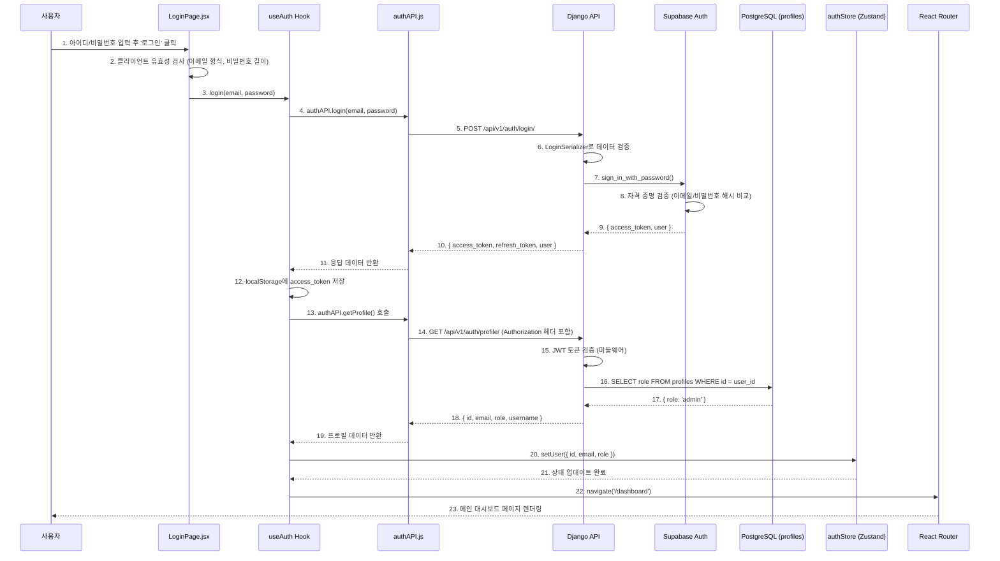
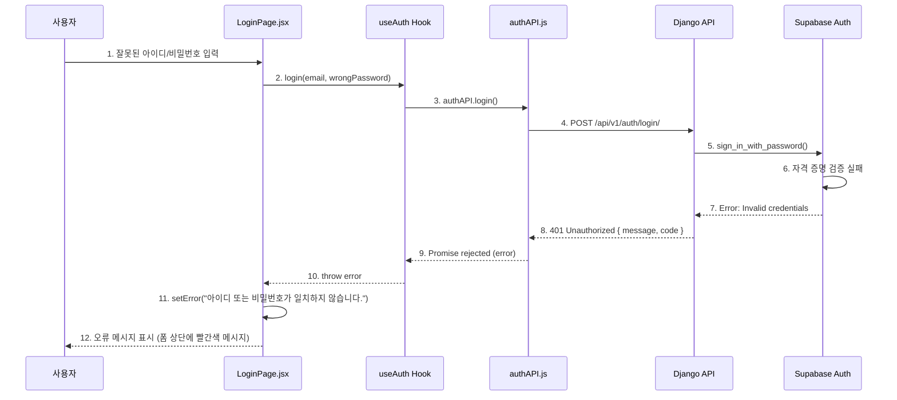

# 로그인 페이지 구현 계획 (Login Page Implementation Plan)

**작성일:** 2025-11-13
**대상 페이지:** 로그인 페이지 (Login Page)
**참조 유스케이스:** UC-001 (사용자 로그인)
**우선순위:** P0 (최우선)

---

## 문서 목적

본 문서는 로그인 페이지의 **프론트엔드 컴포넌트**, **백엔드 API 엔드포인트**, **데이터 플로우**, **에러 핸들링**, **테스트 계획**을 포함한 전체 구현 계획을 정의합니다. TDD 방식을 따르며, 공통 모듈을 최대한 활용하여 DRY 원칙을 준수합니다.

---

## 1. 개요 및 요구사항

### 1.1 기능 요약

- 사용자가 아이디(이메일)와 비밀번호를 입력하여 시스템에 로그인
- Supabase Auth를 통한 인증 처리
- 인증 성공 시 사용자 역할(role) 조회 및 전역 상태 저장
- 로그인 성공 후 메인 대시보드로 자동 리디렉션
- 이미 로그인된 사용자는 자동으로 대시보드로 이동

### 1.2 참조 문서

- **PRD:** `/docs/PRD.md` (섹션 3, 4)
- **사용자 플로우:** `/docs/userflow.md` (섹션 1.1)
- **유스케이스:** `/docs/usecases/01-login/spec.md`
- **데이터베이스:** `/docs/database.md` (profiles 테이블)
- **공통 모듈:** `/docs/common-modules.md` (섹션 2.1, 3.1, 3.2, 3.3, 3.5)
- **아키텍처:** `/docs/structure.md`
- **TDD 가이드라인:** `/docs/rules/tdd.md`

---

## 2. 프론트엔드 구현 계획

### 2.1 컴포넌트 구조

```
/frontend/src
├── pages/
│   └── LoginPage.jsx          # Smart Component: 로그인 페이지 로직
├── components/
│   ├── auth/
│   │   └── LoginForm.jsx      # Dumb Component: 로그인 폼 UI
│   └── common/
│       ├── Input.jsx          # 공통 입력 필드 (재사용)
│       ├── Button.jsx         # 공통 버튼 (재사용)
│       ├── ErrorMessage.jsx   # 공통 에러 메시지 (재사용)
│       └── LoadingSpinner.jsx # 공통 로딩 스피너 (재사용)
├── hooks/
│   └── useAuth.js             # 로그인 로직을 캡슐화한 커스텀 훅
├── api/
│   └── authAPI.js             # 인증 관련 API 호출 함수
└── store/
    └── authStore.js           # 전역 인증 상태 관리 (Zustand)
```

### 2.2 컴포넌트 상세 설계

#### 2.2.1 LoginPage.jsx (Smart Component)

**책임:**
- 로그인 폼의 상태 관리 (email, password)
- useAuth 훅을 통한 로그인 API 호출
- 에러 및 로딩 상태 관리
- 이미 로그인된 사용자 리디렉션 처리

**주요 로직:**
```jsx
import { useState, useEffect } from 'react';
import { useNavigate } from 'react-router-dom';
import LoginForm from '../components/auth/LoginForm';
import useAuth from '../hooks/useAuth';
import useAuthStore from '../store/authStore';

const LoginPage = () => {
  const [email, setEmail] = useState('');
  const [password, setPassword] = useState('');
  const [error, setError] = useState(null);
  const [loading, setLoading] = useState(false);

  const { login } = useAuth();
  const { isAuthenticated } = useAuthStore();
  const navigate = useNavigate();

  // 이미 로그인된 사용자는 대시보드로 리디렉션
  useEffect(() => {
    if (isAuthenticated) {
      navigate('/dashboard');
    }
  }, [isAuthenticated, navigate]);

  const handleSubmit = async (e) => {
    e.preventDefault();
    setError(null);
    setLoading(true);

    try {
      await login(email, password);
      // login 함수 내부에서 navigate('/dashboard') 처리됨
    } catch (err) {
      setError(err.response?.data?.message || '로그인에 실패했습니다.');
    } finally {
      setLoading(false);
    }
  };

  return (
    <div className="min-h-screen flex items-center justify-center bg-gray-50">
      <LoginForm
        email={email}
        password={password}
        onEmailChange={setEmail}
        onPasswordChange={setPassword}
        onSubmit={handleSubmit}
        error={error}
        loading={loading}
      />
    </div>
  );
};

export default LoginPage;
```

**의존성:**
- `useAuth` (hooks/useAuth.js)
- `useAuthStore` (store/authStore.js)
- `LoginForm` (components/auth/LoginForm.jsx)

---

#### 2.2.2 LoginForm.jsx (Dumb Component)

**책임:**
- 순수 UI 렌더링 (props 기반)
- 클라이언트 측 유효성 검사 (실시간 피드백)
- Enter 키로 폼 제출 지원

**Props:**
```typescript
{
  email: string,
  password: string,
  onEmailChange: (value: string) => void,
  onPasswordChange: (value: string) => void,
  onSubmit: (e: Event) => void,
  error: string | null,
  loading: boolean
}
```

**주요 로직:**
```jsx
import Input from '../common/Input';
import Button from '../common/Button';
import ErrorMessage from '../common/ErrorMessage';

const LoginForm = ({
  email,
  password,
  onEmailChange,
  onPasswordChange,
  onSubmit,
  error,
  loading
}) => {
  const [emailError, setEmailError] = useState('');
  const [passwordError, setPasswordError] = useState('');

  // 이메일 유효성 검사
  const validateEmail = (value) => {
    if (!value) {
      setEmailError('아이디를 입력해주세요.');
      return false;
    }
    const emailRegex = /^[^\s@]+@[^\s@]+\.[^\s@]+$/;
    if (!emailRegex.test(value)) {
      setEmailError('올바른 이메일 형식을 입력해주세요.');
      return false;
    }
    setEmailError('');
    return true;
  };

  // 비밀번호 유효성 검사
  const validatePassword = (value) => {
    if (!value) {
      setPasswordError('비밀번호를 입력해주세요.');
      return false;
    }
    if (value.length < 6) {
      setPasswordError('비밀번호는 최소 6자 이상이어야 합니다.');
      return false;
    }
    setPasswordError('');
    return true;
  };

  const handleSubmit = (e) => {
    e.preventDefault();

    const isEmailValid = validateEmail(email);
    const isPasswordValid = validatePassword(password);

    if (isEmailValid && isPasswordValid) {
      onSubmit(e);
    }
  };

  return (
    <div className="w-full max-w-md p-8 bg-white rounded-lg shadow-md">
      <h1 className="text-2xl font-bold text-center mb-6">
        대학교 데이터 대시보드
      </h1>

      <form onSubmit={handleSubmit}>
        <Input
          label="아이디 (이메일)"
          type="email"
          value={email}
          onChange={(e) => onEmailChange(e.target.value)}
          onBlur={() => validateEmail(email)}
          error={emailError}
          placeholder="이메일을 입력하세요"
          required
          autoComplete="email"
        />

        <Input
          label="비밀번호"
          type="password"
          value={password}
          onChange={(e) => onPasswordChange(e.target.value)}
          onBlur={() => validatePassword(password)}
          error={passwordError}
          placeholder="비밀번호를 입력하세요"
          required
          autoComplete="current-password"
        />

        <Button
          type="submit"
          variant="primary"
          disabled={loading || !email || !password}
          loading={loading}
          className="w-full"
        >
          {loading ? '로그인 중...' : '로그인'}
        </Button>

        {error && (
          <div className="mt-4">
            <ErrorMessage message={error} />
          </div>
        )}
      </form>
    </div>
  );
};

export default LoginForm;
```

**사용하는 공통 컴포넌트:**
- `Input` (common/Input.jsx) - 공통 모듈에서 이미 구현됨
- `Button` (common/Button.jsx) - 공통 모듈에서 이미 구현됨
- `ErrorMessage` (common/ErrorMessage.jsx) - 공통 모듈에서 이미 구현됨

---

### 2.3 커스텀 훅: useAuth.js

**책임:**
- 로그인 및 로그아웃 비즈니스 로직 캡슐화
- authAPI 호출 및 전역 상태 업데이트
- 로그인 성공 시 토큰 저장 및 리디렉션

**구현:**
```javascript
// src/hooks/useAuth.js

import useAuthStore from '../store/authStore';
import { authAPI } from '../api/authAPI';
import { useNavigate } from 'react-router-dom';

const useAuth = () => {
  const { user, isAuthenticated, setUser, logout } = useAuthStore();
  const navigate = useNavigate();

  const login = async (email, password) => {
    try {
      // 1. Supabase Auth 로그인 API 호출
      const { access_token, user: userData } = await authAPI.login(email, password);

      // 2. 토큰을 localStorage에 저장
      localStorage.setItem('access_token', access_token);

      // 3. 사용자 프로필 조회 (role 정보 포함)
      const profile = await authAPI.getProfile();

      // 4. 전역 상태에 사용자 정보 저장
      setUser({
        ...userData,
        role: profile.role
      });

      // 5. 대시보드로 리디렉션
      navigate('/dashboard');
    } catch (error) {
      console.error('로그인 실패:', error);
      throw error;
    }
  };

  const handleLogout = async () => {
    try {
      await authAPI.logout();
      localStorage.removeItem('access_token');
      logout();
      navigate('/login');
    } catch (error) {
      console.error('로그아웃 실패:', error);
    }
  };

  return {
    user,
    isAuthenticated,
    login,
    logout: handleLogout
  };
};

export default useAuth;
```

**의존성:**
- `authAPI` (api/authAPI.js) - 공통 모듈에서 이미 구현됨
- `useAuthStore` (store/authStore.js) - 공통 모듈에서 이미 구현됨

---

## 3. 백엔드 구현 계획

### 3.1 API 엔드포인트

#### 3.1.1 로그인 API

**엔드포인트:** `POST /api/v1/auth/login/`

**Request Body:**
```json
{
  "email": "admin@university.ac.kr",
  "password": "validPassword123"
}
```

**Response (성공 - 200 OK):**
```json
{
  "access_token": "eyJhbGciOiJIUzI1NiIsInR5cCI6IkpXVCJ9...",
  "refresh_token": "...",
  "user": {
    "id": "uuid-here",
    "email": "admin@university.ac.kr"
  }
}
```

**Response (실패 - 401 Unauthorized):**
```json
{
  "message": "아이디 또는 비밀번호가 일치하지 않습니다.",
  "code": "INVALID_CREDENTIALS"
}
```

**Response (실패 - 500 Internal Server Error):**
```json
{
  "message": "서버에 연결할 수 없습니다. 잠시 후 다시 시도해주세요.",
  "code": "SERVER_ERROR"
}
```

---

#### 3.1.2 사용자 프로필 조회 API

**엔드포인트:** `GET /api/v1/auth/profile/`

**Request Headers:**
```
Authorization: Bearer {access_token}
```

**Response (성공 - 200 OK):**
```json
{
  "id": "uuid-here",
  "email": "admin@university.ac.kr",
  "role": "admin",
  "username": "홍길동",
  "created_at": "2025-11-13T00:00:00Z"
}
```

**Response (실패 - 401 Unauthorized):**
```json
{
  "message": "유효하지 않은 토큰입니다.",
  "code": "INVALID_TOKEN"
}
```

---

### 3.2 백엔드 레이어 구조

```
/backend/apps/users
├── models.py              # Profile 모델 (공통 모듈에서 이미 정의됨)
├── views.py               # API 엔드포인트
├── serializers.py         # 요청/응답 직렬화
├── middleware.py          # JWT 토큰 검증 미들웨어 (공통 모듈에서 이미 구현됨)
├── urls.py                # URL 라우팅
└── tests/
    ├── test_login_api.py  # 로그인 API 테스트
    └── test_profile_api.py # 프로필 조회 API 테스트
```

---

### 3.3 Views 구현 (Presentation Layer)

**파일:** `apps/users/views.py`

**책임:**
- HTTP 요청을 받고 Serializer로 유효성 검증
- Supabase Auth SDK를 통해 인증 처리
- profiles 테이블에서 role 조회
- 응답 데이터 직렬화 및 반환

**구현:**
```python
# apps/users/views.py

from rest_framework.views import APIView
from rest_framework.response import Response
from rest_framework import status
from rest_framework.permissions import AllowAny, IsAuthenticated
from .serializers import LoginSerializer, ProfileSerializer
from .repositories import ProfileRepository
from supabase import create_client, Client
from django.conf import settings

supabase: Client = create_client(settings.SUPABASE_URL, settings.SUPABASE_KEY)

class LoginView(APIView):
    """
    사용자 로그인 API

    POST /api/v1/auth/login/
    """
    permission_classes = [AllowAny]

    def post(self, request):
        # 1. 입력 데이터 검증
        serializer = LoginSerializer(data=request.data)
        if not serializer.is_valid():
            return Response(
                serializer.errors,
                status=status.HTTP_400_BAD_REQUEST
            )

        email = serializer.validated_data['email']
        password = serializer.validated_data['password']

        try:
            # 2. Supabase Auth를 통한 인증
            auth_response = supabase.auth.sign_in_with_password({
                "email": email,
                "password": password
            })

            if not auth_response.user:
                return Response(
                    {
                        "message": "아이디 또는 비밀번호가 일치하지 않습니다.",
                        "code": "INVALID_CREDENTIALS"
                    },
                    status=status.HTTP_401_UNAUTHORIZED
                )

            # 3. 응답 데이터 구성
            return Response({
                "access_token": auth_response.session.access_token,
                "refresh_token": auth_response.session.refresh_token,
                "user": {
                    "id": auth_response.user.id,
                    "email": auth_response.user.email
                }
            }, status=status.HTTP_200_OK)

        except Exception as e:
            # 4. 예외 처리
            return Response(
                {
                    "message": "서버에 연결할 수 없습니다. 잠시 후 다시 시도해주세요.",
                    "code": "SERVER_ERROR"
                },
                status=status.HTTP_500_INTERNAL_SERVER_ERROR
            )


class ProfileView(APIView):
    """
    사용자 프로필 조회 API

    GET /api/v1/auth/profile/
    """
    permission_classes = [IsAuthenticated]

    def get(self, request):
        try:
            # 미들웨어에서 검증된 user_id 사용
            user_id = request.user.id

            # Repository를 통해 프로필 조회
            profile_repo = ProfileRepository()
            profile = profile_repo.get_by_id(user_id)

            if not profile:
                return Response(
                    {
                        "message": "사용자 권한 정보를 불러올 수 없습니다.",
                        "code": "ROLE_NOT_FOUND"
                    },
                    status=status.HTTP_404_NOT_FOUND
                )

            # Serializer를 통해 응답 데이터 직렬화
            serializer = ProfileSerializer(profile)
            return Response(serializer.data, status=status.HTTP_200_OK)

        except Exception as e:
            return Response(
                {
                    "message": "프로필 조회 중 오류가 발생했습니다.",
                    "code": "SERVER_ERROR"
                },
                status=status.HTTP_500_INTERNAL_SERVER_ERROR
            )


class LogoutView(APIView):
    """
    사용자 로그아웃 API

    POST /api/v1/auth/logout/
    """
    permission_classes = [IsAuthenticated]

    def post(self, request):
        try:
            # Supabase Auth 로그아웃 처리
            supabase.auth.sign_out()

            return Response(
                {"message": "로그아웃되었습니다."},
                status=status.HTTP_200_OK
            )
        except Exception as e:
            return Response(
                {
                    "message": "로그아웃 중 오류가 발생했습니다.",
                    "code": "SERVER_ERROR"
                },
                status=status.HTTP_500_INTERNAL_SERVER_ERROR
            )
```

---

### 3.4 Serializers 구현

**파일:** `apps/users/serializers.py`

```python
# apps/users/serializers.py

from rest_framework import serializers
from .models import Profile

class LoginSerializer(serializers.Serializer):
    """로그인 요청 데이터 검증"""
    email = serializers.EmailField(required=True)
    password = serializers.CharField(required=True, min_length=6)


class ProfileSerializer(serializers.ModelSerializer):
    """사용자 프로필 응답 데이터"""
    class Meta:
        model = Profile
        fields = ['id', 'role', 'username', 'created_at']
```

---

### 3.5 Repository 구현 (Data Access Layer)

**파일:** `apps/users/repositories.py`

```python
# apps/users/repositories.py

from .models import Profile
from typing import Optional

class ProfileRepository:
    """Profile 데이터 접근 레이어"""

    def get_by_id(self, user_id: str) -> Optional[Profile]:
        """
        사용자 ID로 프로필 조회

        Args:
            user_id: Supabase Auth 사용자 ID (UUID)

        Returns:
            Profile 객체 또는 None
        """
        try:
            return Profile.objects.get(id=user_id)
        except Profile.DoesNotExist:
            return None

    def create(self, user_id: str, role: str, username: str = None) -> Profile:
        """
        새로운 프로필 생성

        Args:
            user_id: Supabase Auth 사용자 ID
            role: 사용자 역할 (admin 또는 general)
            username: 사용자 이름 (선택)

        Returns:
            생성된 Profile 객체
        """
        return Profile.objects.create(
            id=user_id,
            role=role,
            username=username
        )
```

**참고:** ProfileRepository는 공통 모듈에서 이미 정의되어 있으므로, 여기서는 로그인 페이지에 필요한 메소드만 사용합니다.

---

### 3.6 URL 라우팅

**파일:** `apps/users/urls.py`

```python
# apps/users/urls.py

from django.urls import path
from .views import LoginView, ProfileView, LogoutView

urlpatterns = [
    path('login/', LoginView.as_view(), name='login'),
    path('profile/', ProfileView.as_view(), name='profile'),
    path('logout/', LogoutView.as_view(), name='logout'),
]
```

**프로젝트 전역 URL 설정:**
```python
# dashboard_project/urls.py

from django.contrib import admin
from django.urls import path, include

urlpatterns = [
    path('admin/', admin.site.urls),
    path('api/v1/auth/', include('apps.users.urls')),
]
```

---

## 4. 데이터 플로우

### 4.1 로그인 성공 플로우



---

### 4.2 로그인 실패 플로우 (자격 증명 불일치)



---

## 5. 에러 핸들링

### 5.1 클라이언트 측 에러 처리

| 에러 상황 | 감지 시점 | 처리 방법 | 사용자 메시지 |
|----------|---------|---------|-------------|
| **이메일 형식 오류** | 입력 필드 blur 시 | 필드 아래 빨간색 메시지 표시 | "올바른 이메일 형식을 입력해주세요." |
| **비밀번호 길이 부족** | 입력 필드 blur 시 | 필드 아래 빨간색 메시지 표시 | "비밀번호는 최소 6자 이상이어야 합니다." |
| **필수 필드 누락** | 로그인 버튼 클릭 시 | 버튼 비활성화 또는 클릭 시 메시지 | "아이디를 입력해주세요." / "비밀번호를 입력해주세요." |

### 5.2 서버 측 에러 처리

| HTTP 상태 코드 | 에러 코드 | 발생 원인 | 사용자 메시지 |
|--------------|----------|---------|-------------|
| **400 Bad Request** | VALIDATION_ERROR | 입력 데이터 형식 오류 | "입력 정보가 올바르지 않습니다." |
| **401 Unauthorized** | INVALID_CREDENTIALS | 자격 증명 불일치 | "아이디 또는 비밀번호가 일치하지 않습니다." |
| **403 Forbidden** | ACCOUNT_DISABLED | 계정 비활성화 | "계정에 문제가 발생했습니다. 관리자에게 문의하세요." |
| **404 Not Found** | ROLE_NOT_FOUND | 프로필 조회 실패 | "사용자 권한 정보를 불러올 수 없습니다. 관리자에게 문의하세요." |
| **500 Internal Server Error** | SERVER_ERROR | 서버 내부 오류 | "서버에 연결할 수 없습니다. 잠시 후 다시 시도해주세요." |
| **네트워크 오류** | ERR_NETWORK | 인터넷 연결 끊김 | "서버에 연결할 수 없습니다. 네트워크 연결을 확인해주세요." |

### 5.3 에러 로깅

**프론트엔드:**
- `console.error()`로 개발자 콘솔에 에러 출력
- 프로덕션 환경에서는 Sentry 등의 에러 트래킹 도구 연동 고려

**백엔드:**
- Django 기본 로거를 통해 서버 로그에 기록
- 중요한 에러는 `logger.error()`로 명시적으로 기록

---

## 6. 테스트 계획 (TDD)

### 6.1 TDD 프로세스

본 프로젝트는 **Red → Green → Refactor** 사이클을 엄격히 준수합니다.

1. **RED Phase**: 실패하는 테스트를 먼저 작성
2. **GREEN Phase**: 테스트를 통과하는 최소한의 코드 작성
3. **REFACTOR Phase**: 중복 제거 및 코드 개선 (테스트는 계속 통과)

---

### 6.2 백엔드 테스트

#### 6.2.1 단위 테스트 (Unit Tests)

**파일:** `apps/users/tests/test_repositories.py`

**테스트 대상:** ProfileRepository

**테스트 케이스:**
```python
# apps/users/tests/test_repositories.py

import pytest
from apps.users.models import Profile, UserRole
from apps.users.repositories import ProfileRepository

@pytest.mark.django_db
class TestProfileRepository:

    def test_get_by_id_existing_user(self):
        """존재하는 사용자 ID로 프로필 조회 성공"""
        # Arrange
        profile = Profile.objects.create(
            id='test-uuid-123',
            role=UserRole.ADMIN,
            username='테스트 관리자'
        )
        repo = ProfileRepository()

        # Act
        result = repo.get_by_id('test-uuid-123')

        # Assert
        assert result is not None
        assert result.id == 'test-uuid-123'
        assert result.role == UserRole.ADMIN
        assert result.username == '테스트 관리자'

    def test_get_by_id_non_existing_user(self):
        """존재하지 않는 사용자 ID로 조회 시 None 반환"""
        # Arrange
        repo = ProfileRepository()

        # Act
        result = repo.get_by_id('non-existing-uuid')

        # Assert
        assert result is None

    def test_create_profile_success(self):
        """새로운 프로필 생성 성공"""
        # Arrange
        repo = ProfileRepository()

        # Act
        profile = repo.create(
            user_id='new-uuid-456',
            role=UserRole.GENERAL,
            username='일반 사용자'
        )

        # Assert
        assert profile.id == 'new-uuid-456'
        assert profile.role == UserRole.GENERAL
        assert profile.username == '일반 사용자'
        assert Profile.objects.filter(id='new-uuid-456').exists()
```

**실행 방법:**
```bash
pytest apps/users/tests/test_repositories.py -v
```

---

#### 6.2.2 통합 테스트 (Integration Tests)

**파일:** `apps/users/tests/test_login_api.py`

**테스트 대상:** LoginView API

**테스트 케이스:**
```python
# apps/users/tests/test_login_api.py

import pytest
from rest_framework.test import APIClient
from unittest.mock import patch, MagicMock

@pytest.mark.django_db
class TestLoginAPI:

    @pytest.fixture
    def api_client(self):
        """API 클라이언트 fixture"""
        return APIClient()

    @patch('apps.users.views.supabase')
    def test_login_success(self, mock_supabase, api_client):
        """로그인 성공 케이스"""
        # Arrange
        mock_auth_response = MagicMock()
        mock_auth_response.user.id = 'test-user-id'
        mock_auth_response.user.email = 'test@example.com'
        mock_auth_response.session.access_token = 'mock-access-token'
        mock_auth_response.session.refresh_token = 'mock-refresh-token'
        mock_supabase.auth.sign_in_with_password.return_value = mock_auth_response

        # Act
        response = api_client.post('/api/v1/auth/login/', {
            'email': 'test@example.com',
            'password': 'validpass123'
        })

        # Assert
        assert response.status_code == 200
        assert 'access_token' in response.data
        assert 'user' in response.data
        assert response.data['user']['email'] == 'test@example.com'

    @patch('apps.users.views.supabase')
    def test_login_invalid_credentials(self, mock_supabase, api_client):
        """잘못된 자격 증명으로 로그인 실패"""
        # Arrange
        mock_supabase.auth.sign_in_with_password.side_effect = Exception("Invalid credentials")

        # Act
        response = api_client.post('/api/v1/auth/login/', {
            'email': 'test@example.com',
            'password': 'wrongpassword'
        })

        # Assert
        assert response.status_code == 500
        assert 'message' in response.data

    def test_login_missing_email(self, api_client):
        """이메일 누락 시 400 에러"""
        # Act
        response = api_client.post('/api/v1/auth/login/', {
            'password': 'validpass123'
        })

        # Assert
        assert response.status_code == 400
        assert 'email' in response.data

    def test_login_invalid_email_format(self, api_client):
        """잘못된 이메일 형식으로 400 에러"""
        # Act
        response = api_client.post('/api/v1/auth/login/', {
            'email': 'invalid-email',
            'password': 'validpass123'
        })

        # Assert
        assert response.status_code == 400
        assert 'email' in response.data

    def test_login_short_password(self, api_client):
        """6자 미만 비밀번호로 400 에러"""
        # Act
        response = api_client.post('/api/v1/auth/login/', {
            'email': 'test@example.com',
            'password': '12345'
        })

        # Assert
        assert response.status_code == 400
        assert 'password' in response.data
```

**실행 방법:**
```bash
pytest apps/users/tests/test_login_api.py -v
```

---

#### 6.2.3 프로필 조회 API 테스트

**파일:** `apps/users/tests/test_profile_api.py`

```python
# apps/users/tests/test_profile_api.py

import pytest
from rest_framework.test import APIClient
from apps.users.models import Profile, UserRole

@pytest.mark.django_db
class TestProfileAPI:

    @pytest.fixture
    def api_client(self):
        return APIClient()

    @pytest.fixture
    def test_profile(self):
        """테스트용 프로필 생성"""
        return Profile.objects.create(
            id='test-user-id',
            role=UserRole.ADMIN,
            username='관리자'
        )

    def test_get_profile_success(self, api_client, test_profile):
        """인증된 사용자의 프로필 조회 성공"""
        # Arrange
        api_client.force_authenticate(user=test_profile)

        # Act
        response = api_client.get('/api/v1/auth/profile/')

        # Assert
        assert response.status_code == 200
        assert response.data['id'] == 'test-user-id'
        assert response.data['role'] == 'admin'
        assert response.data['username'] == '관리자'

    def test_get_profile_unauthenticated(self, api_client):
        """인증되지 않은 요청 시 401 에러"""
        # Act
        response = api_client.get('/api/v1/auth/profile/')

        # Assert
        assert response.status_code == 401

    def test_get_profile_not_found(self, api_client):
        """프로필이 없는 사용자 조회 시 404 에러"""
        # Arrange (profiles 테이블에 없는 가상의 user_id)
        mock_user = MagicMock()
        mock_user.id = 'non-existing-uuid'
        api_client.force_authenticate(user=mock_user)

        # Act
        response = api_client.get('/api/v1/auth/profile/')

        # Assert
        assert response.status_code == 404
        assert response.data['code'] == 'ROLE_NOT_FOUND'
```

---

### 6.3 프론트엔드 테스트

#### 6.3.1 컴포넌트 단위 테스트

**파일:** `frontend/src/components/auth/__tests__/LoginForm.test.jsx`

**테스트 대상:** LoginForm.jsx

**테스트 케이스:**
```javascript
// src/components/auth/__tests__/LoginForm.test.jsx

import { describe, it, expect, vi } from 'vitest';
import { render, screen, fireEvent, waitFor } from '@testing-library/react';
import LoginForm from '../LoginForm';

describe('LoginForm Component', () => {

  it('렌더링 시 모든 필드가 표시됨', () => {
    // Arrange
    const mockProps = {
      email: '',
      password: '',
      onEmailChange: vi.fn(),
      onPasswordChange: vi.fn(),
      onSubmit: vi.fn(),
      error: null,
      loading: false
    };

    // Act
    render(<LoginForm {...mockProps} />);

    // Assert
    expect(screen.getByLabelText(/아이디/i)).toBeInTheDocument();
    expect(screen.getByLabelText(/비밀번호/i)).toBeInTheDocument();
    expect(screen.getByRole('button', { name: /로그인/i })).toBeInTheDocument();
  });

  it('이메일이 없으면 로그인 버튼이 비활성화됨', () => {
    // Arrange
    const mockProps = {
      email: '',
      password: 'validpass123',
      onEmailChange: vi.fn(),
      onPasswordChange: vi.fn(),
      onSubmit: vi.fn(),
      error: null,
      loading: false
    };

    // Act
    render(<LoginForm {...mockProps} />);
    const button = screen.getByRole('button', { name: /로그인/i });

    // Assert
    expect(button).toBeDisabled();
  });

  it('잘못된 이메일 형식 입력 시 에러 메시지 표시', async () => {
    // Arrange
    const mockProps = {
      email: 'invalid-email',
      password: '',
      onEmailChange: vi.fn(),
      onPasswordChange: vi.fn(),
      onSubmit: vi.fn(),
      error: null,
      loading: false
    };

    // Act
    render(<LoginForm {...mockProps} />);
    const emailInput = screen.getByLabelText(/아이디/i);
    fireEvent.blur(emailInput);

    // Assert
    await waitFor(() => {
      expect(screen.getByText(/올바른 이메일 형식을 입력해주세요/i)).toBeInTheDocument();
    });
  });

  it('6자 미만 비밀번호 입력 시 에러 메시지 표시', async () => {
    // Arrange
    const mockProps = {
      email: 'test@example.com',
      password: '12345',
      onEmailChange: vi.fn(),
      onPasswordChange: vi.fn(),
      onSubmit: vi.fn(),
      error: null,
      loading: false
    };

    // Act
    render(<LoginForm {...mockProps} />);
    const passwordInput = screen.getByLabelText(/비밀번호/i);
    fireEvent.blur(passwordInput);

    // Assert
    await waitFor(() => {
      expect(screen.getByText(/비밀번호는 최소 6자 이상/i)).toBeInTheDocument();
    });
  });

  it('로딩 중일 때 버튼이 비활성화되고 텍스트 변경', () => {
    // Arrange
    const mockProps = {
      email: 'test@example.com',
      password: 'validpass123',
      onEmailChange: vi.fn(),
      onPasswordChange: vi.fn(),
      onSubmit: vi.fn(),
      error: null,
      loading: true
    };

    // Act
    render(<LoginForm {...mockProps} />);
    const button = screen.getByRole('button');

    // Assert
    expect(button).toBeDisabled();
    expect(button).toHaveTextContent(/로그인 중/i);
  });

  it('에러 발생 시 에러 메시지 표시', () => {
    // Arrange
    const mockProps = {
      email: 'test@example.com',
      password: 'validpass123',
      onEmailChange: vi.fn(),
      onPasswordChange: vi.fn(),
      onSubmit: vi.fn(),
      error: '아이디 또는 비밀번호가 일치하지 않습니다.',
      loading: false
    };

    // Act
    render(<LoginForm {...mockProps} />);

    // Assert
    expect(screen.getByText(/아이디 또는 비밀번호가 일치하지 않습니다/i)).toBeInTheDocument();
  });

  it('유효한 입력으로 폼 제출 시 onSubmit 호출', () => {
    // Arrange
    const mockSubmit = vi.fn((e) => e.preventDefault());
    const mockProps = {
      email: 'test@example.com',
      password: 'validpass123',
      onEmailChange: vi.fn(),
      onPasswordChange: vi.fn(),
      onSubmit: mockSubmit,
      error: null,
      loading: false
    };

    // Act
    render(<LoginForm {...mockProps} />);
    const button = screen.getByRole('button', { name: /로그인/i });
    fireEvent.click(button);

    // Assert
    expect(mockSubmit).toHaveBeenCalledTimes(1);
  });
});
```

**실행 방법:**
```bash
npm run test
```

---

#### 6.3.2 커스텀 훅 테스트

**파일:** `frontend/src/hooks/__tests__/useAuth.test.js`

```javascript
// src/hooks/__tests__/useAuth.test.js

import { describe, it, expect, vi, beforeEach } from 'vitest';
import { renderHook, waitFor } from '@testing-library/react';
import { BrowserRouter } from 'react-router-dom';
import useAuth from '../useAuth';
import { authAPI } from '../../api/authAPI';

vi.mock('../../api/authAPI');
vi.mock('react-router-dom', async () => {
  const actual = await vi.importActual('react-router-dom');
  return {
    ...actual,
    useNavigate: () => vi.fn()
  };
});

describe('useAuth Hook', () => {

  beforeEach(() => {
    vi.clearAllMocks();
    localStorage.clear();
  });

  it('로그인 성공 시 토큰 저장 및 사용자 정보 설정', async () => {
    // Arrange
    const mockLoginResponse = {
      access_token: 'mock-token',
      user: { id: 'user-123', email: 'test@example.com' }
    };
    const mockProfileResponse = {
      role: 'admin'
    };

    authAPI.login.mockResolvedValue(mockLoginResponse);
    authAPI.getProfile.mockResolvedValue(mockProfileResponse);

    // Act
    const { result } = renderHook(() => useAuth(), {
      wrapper: BrowserRouter
    });

    await waitFor(() => {
      result.current.login('test@example.com', 'password123');
    });

    // Assert
    await waitFor(() => {
      expect(localStorage.getItem('access_token')).toBe('mock-token');
      expect(result.current.user).toEqual({
        id: 'user-123',
        email: 'test@example.com',
        role: 'admin'
      });
      expect(result.current.isAuthenticated).toBe(true);
    });
  });

  it('로그인 실패 시 에러 throw', async () => {
    // Arrange
    const mockError = new Error('Invalid credentials');
    authAPI.login.mockRejectedValue(mockError);

    // Act
    const { result } = renderHook(() => useAuth(), {
      wrapper: BrowserRouter
    });

    // Assert
    await expect(
      result.current.login('test@example.com', 'wrongpassword')
    ).rejects.toThrow('Invalid credentials');
  });
});
```

---

#### 6.3.3 E2E 테스트 (선택 사항)

**도구:** Playwright 또는 Cypress

**테스트 시나리오:**
```javascript
// e2e/login.spec.js (Playwright 예시)

import { test, expect } from '@playwright/test';

test.describe('로그인 페이지 E2E', () => {

  test('유효한 자격 증명으로 로그인 성공 후 대시보드 이동', async ({ page }) => {
    // 1. 로그인 페이지 접속
    await page.goto('http://localhost:5173/login');

    // 2. 아이디 입력
    await page.fill('input[type="email"]', 'admin@university.ac.kr');

    // 3. 비밀번호 입력
    await page.fill('input[type="password"]', 'validPassword123');

    // 4. 로그인 버튼 클릭
    await page.click('button[type="submit"]');

    // 5. 대시보드 페이지로 리디렉션 확인
    await expect(page).toHaveURL('http://localhost:5173/dashboard');

    // 6. 헤더에 '로그아웃' 버튼 표시 확인
    await expect(page.locator('text=로그아웃')).toBeVisible();
  });

  test('잘못된 비밀번호로 로그인 실패 시 에러 메시지 표시', async ({ page }) => {
    // 1. 로그인 페이지 접속
    await page.goto('http://localhost:5173/login');

    // 2. 유효한 이메일과 잘못된 비밀번호 입력
    await page.fill('input[type="email"]', 'admin@university.ac.kr');
    await page.fill('input[type="password"]', 'wrongPassword');

    // 3. 로그인 버튼 클릭
    await page.click('button[type="submit"]');

    // 4. 에러 메시지 표시 확인
    await expect(page.locator('text=아이디 또는 비밀번호가 일치하지 않습니다')).toBeVisible();

    // 5. 여전히 로그인 페이지에 머무름
    await expect(page).toHaveURL('http://localhost:5173/login');
  });
});
```

**실행 방법:**
```bash
npx playwright test e2e/login.spec.js
```

---

### 6.4 테스트 커버리지 목표

| 레이어 | 목표 커버리지 | 비고 |
|-------|-------------|------|
| **백엔드 - Repository** | 90% 이상 | 모든 CRUD 메소드 커버 |
| **백엔드 - Views** | 80% 이상 | 주요 API 엔드포인트 및 에러 케이스 |
| **프론트엔드 - Components** | 70% 이상 | 사용자 인터랙션 및 조건부 렌더링 |
| **프론트엔드 - Hooks** | 80% 이상 | 비즈니스 로직 중심 테스트 |

**확인 방법:**
```bash
# 백엔드
pytest --cov=apps/users --cov-report=html

# 프론트엔드
npm run test:coverage
```

---

## 7. 구현 프로세스 (TDD 기반)

### 7.1 Phase 1: 백엔드 Repository 레이어 (1일차)

**작업 순서:**
1. **RED**: `test_repositories.py` 작성 (실패하는 테스트)
   - `test_get_by_id_existing_user`
   - `test_get_by_id_non_existing_user`
   - `test_create_profile_success`

2. **GREEN**: `ProfileRepository` 구현 (테스트 통과)
   - `get_by_id()` 메소드
   - `create()` 메소드

3. **REFACTOR**: 코드 정리 및 주석 추가

4. **COMMIT**: "feat(auth): ProfileRepository 구현 및 테스트 추가"

**예상 소요 시간:** 2시간

---

### 7.2 Phase 2: 백엔드 API Views (1일차)

**작업 순서:**
1. **RED**: `test_login_api.py` 작성
   - `test_login_success`
   - `test_login_invalid_credentials`
   - `test_login_missing_email`
   - `test_login_invalid_email_format`

2. **GREEN**: `LoginView` 구현
   - Serializer 검증
   - Supabase Auth 호출
   - 응답 생성

3. **REFACTOR**: 에러 핸들링 로직 개선

4. **COMMIT**: "feat(auth): 로그인 API 엔드포인트 구현"

**예상 소요 시간:** 3시간

---

### 7.3 Phase 3: 백엔드 프로필 조회 API (2일차)

**작업 순서:**
1. **RED**: `test_profile_api.py` 작성
   - `test_get_profile_success`
   - `test_get_profile_unauthenticated`
   - `test_get_profile_not_found`

2. **GREEN**: `ProfileView` 구현
   - JWT 토큰 검증 (미들웨어 사용)
   - Repository 호출
   - Serializer 응답

3. **REFACTOR**: 중복 코드 제거

4. **COMMIT**: "feat(auth): 프로필 조회 API 구현"

**예상 소요 시간:** 2시간

---

### 7.4 Phase 4: 프론트엔드 공통 컴포넌트 (2일차)

**작업 순서:**
1. **Input, Button, ErrorMessage 컴포넌트** (공통 모듈에서 이미 구현됨)
   - 테스트 작성 (재사용 검증)

2. **COMMIT**: "test(common): 공통 컴포넌트 테스트 추가"

**예상 소요 시간:** 1시간

---

### 7.5 Phase 5: 프론트엔드 LoginForm (3일차)

**작업 순서:**
1. **RED**: `LoginForm.test.jsx` 작성
   - 렌더링 테스트
   - 유효성 검사 테스트
   - 에러 표시 테스트

2. **GREEN**: `LoginForm.jsx` 구현
   - 입력 필드 렌더링
   - 실시간 유효성 검사
   - 공통 컴포넌트 사용

3. **REFACTOR**: 유효성 검사 로직 분리

4. **COMMIT**: "feat(auth): LoginForm 컴포넌트 구현"

**예상 소요 시간:** 3시간

---

### 7.6 Phase 6: 프론트엔드 useAuth 훅 (3일차)

**작업 순서:**
1. **RED**: `useAuth.test.js` 작성
   - 로그인 성공 테스트
   - 로그인 실패 테스트

2. **GREEN**: `useAuth.js` 구현
   - authAPI 호출
   - 전역 상태 업데이트
   - 리디렉션 처리

3. **REFACTOR**: 에러 처리 로직 개선

4. **COMMIT**: "feat(auth): useAuth 커스텀 훅 구현"

**예상 소요 시간:** 2시간

---

### 7.7 Phase 7: 프론트엔드 LoginPage 통합 (4일차)

**작업 순서:**
1. **LoginPage.jsx** 구현
   - LoginForm과 useAuth 통합
   - 이미 로그인된 사용자 리디렉션

2. **통합 테스트 실행**
   - 백엔드 서버 실행
   - 프론트엔드 개발 서버 실행
   - 수동 E2E 테스트

3. **COMMIT**: "feat(auth): 로그인 페이지 완성"

**예상 소요 시간:** 2시간

---

### 7.8 Phase 8: 전체 테스트 및 버그 수정 (4일차)

**작업 순서:**
1. 전체 테스트 스위트 실행
2. 커버리지 확인
3. 버그 수정 및 엣지 케이스 처리
4. 최종 리팩토링

**예상 소요 시간:** 2시간

---

## 8. 사용할 공통 모듈 목록

### 8.1 백엔드

| 모듈 | 위치 | 역할 | 상태 |
|-----|------|------|------|
| **Profile 모델** | `apps/users/models.py` | 사용자 프로필 데이터 구조 | 공통 모듈에서 이미 정의됨 |
| **SupabaseAuthMiddleware** | `apps/users/middleware.py` | JWT 토큰 검증 | 공통 모듈에서 이미 구현됨 |
| **BaseRepository** | `apps/core/repositories.py` | 기본 Repository 클래스 | 공통 모듈에서 이미 구현됨 |
| **ProfileRepository** | `apps/users/repositories.py` | Profile 데이터 접근 | 공통 모듈에서 이미 구현됨 |

### 8.2 프론트엔드

| 모듈 | 위치 | 역할 | 상태 |
|-----|------|------|------|
| **Input** | `components/common/Input.jsx` | 입력 필드 컴포넌트 | 공통 모듈에서 이미 구현됨 |
| **Button** | `components/common/Button.jsx` | 버튼 컴포넌트 | 공통 모듈에서 이미 구현됨 |
| **ErrorMessage** | `components/common/ErrorMessage.jsx` | 에러 메시지 컴포넌트 | 공통 모듈에서 이미 구현됨 |
| **LoadingSpinner** | `components/common/LoadingSpinner.jsx` | 로딩 스피너 | 공통 모듈에서 이미 구현됨 |
| **authAPI** | `api/authAPI.js` | 인증 API 호출 함수 | 공통 모듈에서 이미 구현됨 |
| **apiClient** | `api/index.js` | Axios 인스턴스 | 공통 모듈에서 이미 구현됨 |
| **useAuthStore** | `store/authStore.js` | 전역 인증 상태 관리 | 공통 모듈에서 이미 구현됨 |
| **ProtectedRoute** | `components/auth/ProtectedRoute.jsx` | 인증 가드 | 공통 모듈에서 이미 구현됨 |

---

## 9. 비기능 요구사항

### 9.1 성능

- **로그인 완료까지 2초 이내** (정상 네트워크 환경)
- **API 응답 시간: 500ms 이하**
- **클라이언트 측 유효성 검사: 즉시 피드백 (0ms)**

### 9.2 보안

- **HTTPS 통신**: 프로덕션 환경에서 필수
- **비밀번호 평문 저장 금지**: Supabase Auth가 bcrypt로 해싱 처리
- **JWT 토큰 만료 시간**: 1시간 (Supabase 기본 설정)
- **XSS 방지**: React의 기본 보안 기능 활용

### 9.3 접근성 (Accessibility)

- **키보드 네비게이션**: Tab 키로 필드 이동, Enter로 제출
- **스크린 리더 지원**: label과 aria-label 제공
- **색상 대비**: WCAG AA 기준 준수
- **터치 타겟**: 최소 44x44px (모바일)

### 9.4 반응형 디자인

- **모바일**: 320px ~ 767px
- **태블릿**: 768px ~ 1023px
- **데스크톱**: 1024px 이상

---

## 10. 배포 및 환경 설정

### 10.1 환경 변수

**백엔드 (.env):**
```bash
SUPABASE_URL=https://your-project.supabase.co
SUPABASE_KEY=your-anon-key
SUPABASE_SERVICE_KEY=your-service-key
SECRET_KEY=django-secret-key
DEBUG=False
ALLOWED_HOSTS=your-railway-domain.up.railway.app
CORS_ALLOWED_ORIGINS=https://your-frontend-domain.com
```

**프론트엔드 (.env):**
```bash
VITE_API_BASE_URL=https://your-backend-domain.up.railway.app/api/v1
VITE_SUPABASE_URL=https://your-project.supabase.co
VITE_SUPABASE_ANON_KEY=your-anon-key
```

### 10.2 배포 체크리스트

- [ ] Supabase 프로젝트 생성 및 PostgreSQL 설정
- [ ] 백엔드 Railway 배포
- [ ] 프론트엔드 Vercel/Netlify 배포
- [ ] 환경 변수 설정 완료
- [ ] CORS 설정 확인
- [ ] HTTPS 인증서 적용 확인
- [ ] 프로덕션 환경에서 로그인 테스트

---

## 11. 리스크 및 완화 전략

| 리스크 | 영향도 | 완화 전략 |
|-------|-------|---------|
| **Supabase Auth 통합 오류** | 높음 | 공식 문서 및 예제 코드 사전 검토, Mock을 활용한 단위 테스트 |
| **JWT 토큰 만료 처리 미흡** | 중간 | Refresh Token 자동 갱신 로직 구현 (향후 개선 사항) |
| **프론트엔드 상태 동기화 문제** | 중간 | Zustand 사용으로 단순하고 명확한 상태 관리 |
| **네트워크 오류 처리 부족** | 중간 | API Client에서 통합 에러 핸들링, 재시도 로직 추가 |

---

## 12. 향후 개선 사항 (MVP 이후)

1. **소셜 로그인 지원** (Google, Microsoft)
2. **비밀번호 찾기/재설정 기능**
3. **2단계 인증 (2FA)**
4. **로그인 시도 횟수 제한** (Brute Force 방지)
5. **Refresh Token 자동 갱신**
6. **로그인 기록 저장 및 조회**

---

## 13. 완료 기준 (Definition of Done)

로그인 페이지가 완료되었다고 판단하는 기준:

- [ ] 모든 단위 테스트 통과 (백엔드 + 프론트엔드)
- [ ] 통합 테스트 통과
- [ ] 테스트 커버리지 목표 달성
- [ ] 수동 E2E 테스트 통과 (로그인 성공/실패 시나리오)
- [ ] 코드 리뷰 완료
- [ ] 문서화 완료 (API 명세, 컴포넌트 Props)
- [ ] 반응형 디자인 확인 (모바일/태블릿/데스크톱)
- [ ] 접근성 검증 (키보드 네비게이션, 스크린 리더)
- [ ] 프로덕션 환경 배포 및 검증

---

## 14. 예상 소요 시간 요약

| Phase | 작업 내용 | 예상 시간 |
|-------|---------|---------|
| **Phase 1** | 백엔드 Repository | 2시간 |
| **Phase 2** | 백엔드 로그인 API | 3시간 |
| **Phase 3** | 백엔드 프로필 조회 API | 2시간 |
| **Phase 4** | 프론트엔드 공통 컴포넌트 테스트 | 1시간 |
| **Phase 5** | 프론트엔드 LoginForm | 3시간 |
| **Phase 6** | 프론트엔드 useAuth 훅 | 2시간 |
| **Phase 7** | 프론트엔드 LoginPage 통합 | 2시간 |
| **Phase 8** | 전체 테스트 및 버그 수정 | 2시간 |
| **총 예상 시간** | | **17시간 (약 2.5일)** |

---

## 15. 참조 문서

- **PRD**: `/docs/PRD.md`
- **사용자 플로우**: `/docs/userflow.md`
- **유스케이스**: `/docs/usecases/01-login/spec.md`
- **데이터베이스 스키마**: `/docs/database.md`
- **아키텍처**: `/docs/structure.md`
- **공통 모듈**: `/docs/common-modules.md`
- **TDD 가이드라인**: `/docs/rules/tdd.md`
- **기술 스택**: `/docs/techstack.md`

---

**작성 완료일:** 2025-11-13
**최종 검토자:** Development Team
**승인일:** [TBD]
