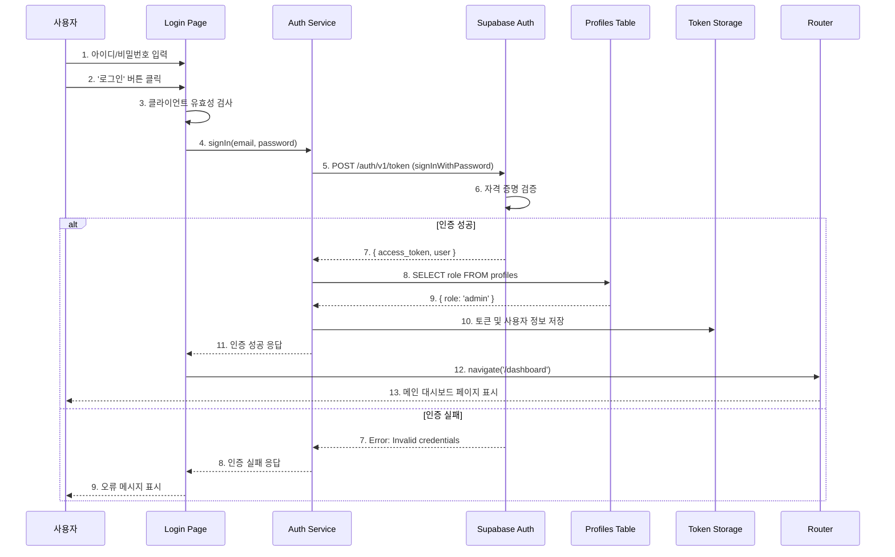

# 유스케이스 작성 템플릿

## 유스케이스 ID: UC-001

### 제목
사용자 로그인 (User Login)

---

## 1. 개요

### 1.1 목적
허가된 사용자(관리자 및 일반 사용자)가 아이디와 비밀번호를 통해 시스템에 인증하고, 역할에 따라 적절한 권한으로 대시보드 시스템에 접근할 수 있도록 한다.

### 1.2 범위
- **포함**: 아이디/비밀번호 기반 인증, 접근 토큰 발급, 역할 기반 접근 제어, 로그인 실패 처리
- **제외**: 회원가입 기능, 소셜 로그인, 2단계 인증(2FA), 비밀번호 찾기/재설정

### 1.3 액터
- **주요 액터**:
  - 관리자 (Admin User): 데이터 업로드 페이지 및 메인 대시보드 접근 권한 보유
  - 일반 사용자 (General User): 메인 대시보드 조회 권한만 보유
- **부 액터**:
  - Supabase Auth 서비스: 사용자 인증 처리

---

## 2. 선행 조건

- 사용자 계정이 Supabase Auth 시스템에 사전 등록되어 있어야 한다.
- 사용자의 역할(role) 정보가 `profiles` 테이블에 저장되어 있어야 한다. (admin 또는 general)
- 사용자가 로그인 페이지에 접근할 수 있는 네트워크 환경이어야 한다.
- 클라이언트 애플리케이션이 정상적으로 로드되어 있어야 한다.

---

## 3. 참여 컴포넌트

- **Login Page (Frontend)**: 사용자 입력을 받고 유효성 검사를 수행하는 UI 컴포넌트
- **Authentication Service (Frontend)**: Supabase Auth와 통신하여 인증을 처리하는 클라이언트 서비스
- **Supabase Auth**: 사용자 자격 증명을 검증하고 접근 토큰을 발급하는 외부 인증 서비스
- **Profiles Table (Database)**: 사용자의 역할(role) 정보를 저장하는 데이터베이스 테이블
- **Router (Frontend)**: 인증 성공 후 적절한 페이지로 리디렉션을 처리
- **Token Storage (Frontend)**: 발급받은 접근 토큰을 브라우저에 안전하게 저장 (LocalStorage/SessionStorage)

---

## 4. 기본 플로우 (Basic Flow)

### 4.1 단계별 흐름

1. **[사용자]**: 로그인 페이지에 접근한다.
   - 입력: 브라우저 URL 입력 또는 북마크 클릭
   - 처리: 라우터가 로그인 페이지 컴포넌트를 렌더링
   - 출력: 아이디/비밀번호 입력 폼이 화면에 표시됨

2. **[사용자]**: 아이디(이메일) 입력 필드에 자신의 아이디를 입력한다.
   - 입력: 사용자 아이디 (이메일 형식)
   - 처리: 클라이언트에서 실시간 유효성 검사 (이메일 형식 확인)
   - 출력: 유효하지 않은 경우 필드 아래에 경고 메시지 표시

3. **[사용자]**: 비밀번호 입력 필드에 비밀번호를 입력한다.
   - 입력: 사용자 비밀번호 (마스킹 처리됨)
   - 처리: 클라이언트에서 최소 길이 확인 (6자 이상)
   - 출력: 유효하지 않은 경우 필드 아래에 경고 메시지 표시

4. **[사용자]**: '로그인' 버튼을 클릭한다.
   - 입력: 버튼 클릭 이벤트
   - 처리: 클라이언트가 입력값의 최종 유효성을 검증
   - 출력: 유효하지 않은 경우 로그인 진행하지 않음

5. **[Login Page]**: 입력된 아이디와 비밀번호를 Authentication Service로 전달한다.
   - 입력: { email: string, password: string }
   - 처리: API 요청 전송 준비, 로딩 상태 활성화
   - 출력: 로그인 버튼 비활성화, 로딩 스피너 표시

6. **[Authentication Service]**: Supabase Auth의 signInWithPassword API를 호출한다.
   - 입력: { email, password }
   - 처리: HTTPS POST 요청을 Supabase Auth 엔드포인트로 전송
   - 출력: API 요청 전송

7. **[Supabase Auth]**: 전달받은 자격 증명을 데이터베이스와 비교하여 검증한다.
   - 입력: 사용자가 입력한 이메일과 비밀번호
   - 처리:
     - auth.users 테이블에서 이메일에 해당하는 사용자 조회
     - 비밀번호 해시 비교
   - 출력: 인증 성공 또는 실패 결과

8. **[Supabase Auth]**: 인증 성공 시 접근 토큰(Access Token)과 리프레시 토큰(Refresh Token)을 생성하여 반환한다.
   - 입력: 인증 성공한 사용자 정보
   - 처리: JWT 형식의 토큰 생성 (만료 시간 포함)
   - 출력:
     ```json
     {
       "access_token": "eyJhbGci...",
       "refresh_token": "...",
       "user": {
         "id": "uuid",
         "email": "user@example.com",
         ...
       }
     }
     ```

9. **[Authentication Service]**: Supabase로부터 받은 사용자 정보를 기반으로 profiles 테이블에서 역할 정보를 조회한다.
   - 입력: 사용자 ID (user.id)
   - 처리:
     - Supabase Client를 통해 profiles 테이블 쿼리
     - `SELECT role FROM profiles WHERE id = user.id`
   - 출력: { role: 'admin' | 'general' }

10. **[Authentication Service]**: 토큰과 사용자 정보를 클라이언트 저장소에 안전하게 저장한다.
    - 입력: access_token, refresh_token, user 정보, role
    - 처리:
      - LocalStorage 또는 SessionStorage에 저장
      - 전역 상태 관리 스토어(Zustand/Jotai 등)에 사용자 정보 저장
    - 출력: 저장 완료 상태

11. **[Router]**: 사용자를 '메인 대시보드 페이지'로 리디렉션한다.
    - 입력: 인증 성공 이벤트
    - 처리:
      - React Router의 navigate() 함수 호출
      - URL을 `/dashboard`로 변경
    - 출력: 메인 대시보드 페이지 렌더링

### 4.2 시퀀스 다이어그램



---

## 5. 대안 플로우 (Alternative Flows)

### 5.1 대안 플로우 1: 이미 로그인된 사용자의 로그인 페이지 접근

**시작 조건**: 사용자가 유효한 접근 토큰을 보유한 상태에서 로그인 페이지에 접근

**단계**:
1. 사용자가 로그인 페이지 URL로 직접 접근 시도
2. Router의 인증 가드(Auth Guard)가 Token Storage를 확인
3. 유효한 토큰이 존재하는 경우 즉시 메인 대시보드로 리디렉션
4. 사용자는 로그인 폼을 거치지 않고 바로 대시보드를 이용

**결과**: 불필요한 재로그인 방지, 사용자 경험 향상

---

## 6. 예외 플로우 (Exception Flows)

### 6.1 예외 상황 1: 아이디 또는 비밀번호가 비어있음

**발생 조건**: 사용자가 아이디 또는 비밀번호 필드를 입력하지 않고 로그인 버튼을 클릭

**처리 방법**:
1. 클라이언트 측 유효성 검사에서 빈 필드 감지
2. 해당 필드에 빨간색 테두리 표시
3. 필드 아래에 오류 메시지 표시
4. 로그인 API 호출을 차단

**에러 코드**: `VALIDATION_ERROR` (클라이언트 측, HTTP 요청 없음)

**사용자 메시지**:
- 아이디 누락 시: "아이디를 입력해주세요."
- 비밀번호 누락 시: "비밀번호를 입력해주세요."
- 둘 다 누락 시: 각 필드에 해당 메시지 모두 표시

### 6.2 예외 상황 2: 자격 증명 불일치 (잘못된 아이디 또는 비밀번호)

**발생 조건**: 입력한 아이디 또는 비밀번호가 데이터베이스의 정보와 일치하지 않음

**처리 방법**:
1. Supabase Auth가 인증 실패 응답 반환
2. Authentication Service가 에러를 캐치
3. Login Page에 에러 상태 전달
4. 로그인 폼 상단에 오류 메시지 표시 (Alert 또는 Toast)
5. 입력 필드는 초기화하지 않음 (사용자가 수정 가능하도록)

**에러 코드**: `401` (Unauthorized)

**사용자 메시지**: "아이디 또는 비밀번호가 일치하지 않습니다."

### 6.3 예외 상황 3: 네트워크 오류 또는 서버 연결 실패

**발생 조건**:
- 사용자의 인터넷 연결이 끊김
- Supabase 서버가 일시적으로 응답하지 않음
- API 요청 타임아웃

**처리 방법**:
1. Authentication Service에서 네트워크 예외 감지
2. 에러 타입을 확인하여 적절한 메시지 선택
3. Login Page에 일반적인 오류 메시지 표시
4. 재시도 버튼 또는 자동 재시도 로직 제공 (선택 사항)

**에러 코드**:
- `ERR_NETWORK` (네트워크 오류)
- `500` (서버 내부 오류)
- `503` (서비스 이용 불가)

**사용자 메시지**: "서버에 연결할 수 없습니다. 잠시 후 다시 시도해주세요."

### 6.4 예외 상황 4: 계정이 비활성화되었거나 삭제됨

**발생 조건**: 관리자가 해당 사용자 계정을 비활성화했거나 삭제한 경우

**처리 방법**:
1. Supabase Auth가 특정 에러 코드와 함께 응답
2. Authentication Service가 계정 상태 관련 에러임을 식별
3. Login Page에 계정 문제 관련 메시지 표시
4. 사용자에게 관리자 문의를 안내

**에러 코드**: `403` (Forbidden) 또는 Supabase 특정 에러

**사용자 메시지**: "계정에 문제가 발생했습니다. 관리자에게 문의하세요."

### 6.5 예외 상황 5: 역할 정보 조회 실패

**발생 조건**:
- 인증은 성공했으나 profiles 테이블에 해당 사용자의 역할 정보가 없음
- profiles 테이블 조회 중 데이터베이스 오류 발생

**처리 방법**:
1. Authentication Service에서 role 조회 실패 감지
2. 로그인 프로세스 중단
3. 토큰 저장하지 않음
4. Login Page에 시스템 오류 메시지 표시
5. 에러 로그를 백엔드 또는 모니터링 시스템에 전송

**에러 코드**: `ROLE_NOT_FOUND` (커스텀 에러)

**사용자 메시지**: "사용자 권한 정보를 불러올 수 없습니다. 관리자에게 문의하세요."

### 6.6 예외 상황 6: 이메일 형식 오류

**발생 조건**: 사용자가 유효하지 않은 이메일 형식을 아이디 필드에 입력

**처리 방법**:
1. 클라이언트 측 유효성 검사에서 이메일 형식 검증 (정규식 사용)
2. 이메일 필드 아래에 실시간 오류 메시지 표시
3. 로그인 버튼 비활성화 또는 클릭 시 API 호출 차단

**에러 코드**: `VALIDATION_ERROR` (클라이언트 측)

**사용자 메시지**: "올바른 이메일 형식을 입력해주세요."

---

## 7. 후행 조건 (Post-conditions)

### 7.1 성공 시

- **데이터베이스 변경**:
  - Supabase Auth 시스템 내부적으로 세션 정보가 생성되고 저장됨
  - profiles 테이블에는 변경 없음 (조회만 수행)

- **시스템 상태**:
  - 클라이언트에 유효한 Access Token과 Refresh Token이 저장됨
  - 전역 상태에 사용자 정보(id, email, role)가 저장됨
  - 사용자가 "인증됨(authenticated)" 상태로 전환
  - 이후 모든 API 요청에 Access Token이 Authorization 헤더에 포함됨

- **외부 시스템**:
  - Supabase Auth에 활성 세션이 생성됨
  - Refresh Token을 통해 Access Token 갱신 가능 상태

- **UI 상태**:
  - 메인 대시보드 페이지가 렌더링됨
  - 헤더(GNB)에 '로그아웃' 버튼이 표시됨
  - 관리자인 경우: 헤더에 '데이터 관리' 메뉴가 표시됨
  - 일반 사용자인 경우: '데이터 관리' 메뉴는 숨김 처리

### 7.2 실패 시

- **데이터 롤백**:
  - 어떠한 데이터도 저장되지 않음
  - 세션 생성 없음

- **시스템 상태**:
  - 사용자는 여전히 "비인증(unauthenticated)" 상태
  - Token Storage에 토큰이 저장되지 않음
  - 로그인 페이지에 머무름

- **UI 상태**:
  - 오류 메시지가 로그인 폼에 표시됨
  - 로딩 스피너 종료
  - 로그인 버튼 재활성화 (재시도 가능)
  - 비밀번호 필드는 초기화될 수 있음 (보안 고려)

---

## 8. 비기능 요구사항

### 8.1 성능
- **응답 시간**:
  - 정상적인 네트워크 환경에서 로그인 완료까지 2초 이내
  - Supabase Auth API 응답 시간: 평균 500ms 이하
- **동시 접속**:
  - MVP 단계에서 동시 로그인 사용자 최대 50명 지원
- **타임아웃**:
  - API 요청 타임아웃: 10초
  - 10초 초과 시 자동으로 네트워크 오류로 처리

### 8.2 보안
- **비밀번호 보안**:
  - 비밀번호는 전송 시 HTTPS를 통해 암호화
  - 클라이언트에서 비밀번호를 평문으로 저장하지 않음
  - Supabase Auth는 bcrypt를 통해 비밀번호 해싱 처리

- **토큰 보안**:
  - Access Token은 JWT 형식으로 서명되어 위조 방지
  - Access Token 만료 시간: 1시간 (Supabase 기본 설정)
  - Refresh Token은 HTTP-only Cookie 또는 안전한 Storage에 저장
  - XSS 공격 방지를 위해 민감한 정보는 LocalStorage보다 SessionStorage 선호

- **인증 상태 관리**:
  - 토큰 만료 시 자동으로 Refresh Token을 사용하여 갱신
  - 갱신 실패 시 자동으로 로그아웃 처리

- **입력 검증**:
  - 클라이언트와 서버 양쪽에서 이중 검증
  - SQL Injection 방지 (Supabase ORM 레벨에서 자동 처리)

### 8.3 가용성
- **시스템 가동 시간**:
  - Supabase 클라우드 인프라에 의존 (99.9% uptime SLA)
  - Railway 배포 환경의 가용성: 99% 이상

- **복구 시간**:
  - 네트워크 오류 발생 시 사용자는 즉시 재시도 가능
  - Supabase 장애 시 자동 페일오버 (Supabase 내부 처리)

- **오류 처리**:
  - 모든 예외 상황에 대해 사용자 친화적인 메시지 제공
  - 백엔드 오류 발생 시에도 클라이언트가 크래시하지 않도록 방어적 프로그래밍

### 8.4 접근성
- **키보드 네비게이션**:
  - Tab 키를 통해 입력 필드 간 이동 가능
  - Enter 키를 통해 로그인 버튼 활성화 가능

- **스크린 리더 지원**:
  - 입력 필드에 적절한 label 제공
  - 오류 메시지는 aria-live로 즉시 읽힘

- **시각적 피드백**:
  - 로딩 중일 때 명확한 시각적 표시 (스피너, 버튼 비활성화)
  - 에러 발생 시 색상과 텍스트로 이중 표시

---

## 9. UI/UX 요구사항

### 9.1 화면 구성

**로그인 페이지 레이아웃**:
```
+------------------------------------------+
|                                          |
|          [대학교 로고 또는 제목]          |
|                                          |
|  +------------------------------------+  |
|  | 아이디 (이메일)                     |  |
|  | [                                 ] |  |
|  +------------------------------------+  |
|                                          |
|  +------------------------------------+  |
|  | 비밀번호                            |  |
|  | [                                 ] |  |
|  +------------------------------------+  |
|                                          |
|  [     로그인 버튼 (전체 너비)      ]    |
|                                          |
|  [에러 메시지 표시 영역]                 |
|                                          |
+------------------------------------------+
```

**UI 요소**:
- **로고/제목**: 상단 중앙에 배치, 브랜드 아이덴티티 표현
- **아이디 입력 필드**:
  - placeholder: "이메일을 입력하세요"
  - type: email
  - autoComplete: email
- **비밀번호 입력 필드**:
  - placeholder: "비밀번호를 입력하세요"
  - type: password
  - autoComplete: current-password
  - 비밀번호 표시/숨김 토글 아이콘 (선택 사항)
- **로그인 버튼**:
  - 기본 상태: 파란색 배경, 흰색 텍스트
  - 비활성 상태: 회색 배경, 커서 비활성
  - 로딩 상태: 스피너 + "로그인 중..." 텍스트
- **에러 메시지**:
  - 빨간색 텍스트
  - 아이콘(⚠) + 메시지 형식
  - 로그인 버튼 아래 또는 폼 상단에 표시

### 9.2 사용자 경험

**입력 피드백**:
- 실시간 유효성 검사 (이메일 형식, 비밀번호 길이)
- 입력 중일 때는 에러 메시지를 표시하지 않음 (blur 이벤트 발생 시 검사)
- 유효한 입력 시 필드 테두리를 초록색으로 변경 (선택 사항)

**로딩 상태**:
- 로그인 버튼 클릭 후 즉시 로딩 상태로 전환
- 버튼 비활성화로 중복 클릭 방지
- 스피너 애니메이션으로 진행 중임을 명확히 표시

**에러 피드백**:
- 에러 발생 시 해당 필드로 자동 포커스 이동
- 에러 메시지는 3-5초 후 자동으로 사라지지 않음 (사용자가 읽을 시간 보장)
- 사용자가 입력을 수정하기 시작하면 에러 메시지 제거 (선택 사항)

**성공 피드백**:
- 로그인 성공 시 즉시 리디렉션 (별도의 성공 메시지 불필요)
- 리디렉션 전 짧은 성공 애니메이션 (선택 사항, 200ms 이내)

**반응형 디자인**:
- 모바일, 태블릿, 데스크톱 모든 화면 크기 지원
- 모바일에서는 키보드가 표시될 때 로그인 폼이 가려지지 않도록 스크롤 처리

**접근성**:
- 충분한 색상 대비 (WCAG AA 기준 이상)
- 터치 타겟 최소 크기: 44x44px (모바일)

---

## 10. 테스트 시나리오

### 10.1 성공 케이스

| 테스트 케이스 ID | 입력값 | 기대 결과 |
|-----------------|--------|----------|
| TC-001-01 | email: `admin@university.ac.kr`<br>password: `validPassword123` | - 로그인 성공<br>- Access Token 저장됨<br>- role: `admin`<br>- 메인 대시보드로 리디렉션<br>- '데이터 관리' 메뉴 표시됨 |
| TC-001-02 | email: `user@university.ac.kr`<br>password: `validPassword456` | - 로그인 성공<br>- Access Token 저장됨<br>- role: `general`<br>- 메인 대시보드로 리디렉션<br>- '데이터 관리' 메뉴 숨김 |
| TC-001-03 | 이미 로그인된 상태에서<br>로그인 페이지 접근 | - 로그인 폼을 보지 않고<br>즉시 메인 대시보드로 리디렉션 |

### 10.2 실패 케이스

| 테스트 케이스 ID | 입력값 | 기대 결과 |
|-----------------|--------|----------|
| TC-001-04 | email: `(비어있음)`<br>password: `anyPassword` | - 아이디 필드 아래 오류 메시지 표시<br>- "아이디를 입력해주세요."<br>- API 호출 없음 |
| TC-001-05 | email: `admin@university.ac.kr`<br>password: `(비어있음)` | - 비밀번호 필드 아래 오류 메시지 표시<br>- "비밀번호를 입력해주세요."<br>- API 호출 없음 |
| TC-001-06 | email: `invalid-email`<br>password: `anyPassword` | - 아이디 필드 아래 오류 메시지 표시<br>- "올바른 이메일 형식을 입력해주세요."<br>- API 호출 없음 |
| TC-001-07 | email: `wrong@university.ac.kr`<br>password: `wrongPassword` | - 로그인 폼 상단에 오류 메시지 표시<br>- "아이디 또는 비밀번호가 일치하지 않습니다."<br>- HTTP 401 에러 발생 |
| TC-001-08 | email: `admin@university.ac.kr`<br>password: `correctPassword`<br>(네트워크 연결 끊김) | - 오류 메시지 표시<br>- "서버에 연결할 수 없습니다. 잠시 후 다시 시도해주세요."<br>- 재시도 가능 상태 유지 |
| TC-001-09 | email: `disabled@university.ac.kr`<br>password: `correctPassword`<br>(비활성화된 계정) | - 오류 메시지 표시<br>- "계정에 문제가 발생했습니다. 관리자에게 문의하세요."<br>- HTTP 403 에러 발생 |
| TC-001-10 | email: `no-role@university.ac.kr`<br>password: `correctPassword`<br>(profiles에 role 없음) | - 오류 메시지 표시<br>- "사용자 권한 정보를 불러올 수 없습니다. 관리자에게 문의하세요."<br>- 로그인 실패 처리 |

### 10.3 경계 케이스

| 테스트 케이스 ID | 입력값 | 기대 결과 |
|-----------------|--------|----------|
| TC-001-11 | 비밀번호 길이: 6자 (최소 길이) | - 유효성 검사 통과<br>- 정상적으로 로그인 시도 |
| TC-001-12 | 비밀번호 길이: 5자 (최소 길이 미만) | - 오류 메시지 표시<br>- "비밀번호는 최소 6자 이상이어야 합니다."<br>- API 호출 없음 |
| TC-001-13 | 매우 긴 이메일<br>(255자) | - 정상적으로 처리<br>- 입력 필드에서 잘림 없이 표시 |
| TC-001-14 | 로그인 버튼 연속 클릭 (더블 클릭) | - 첫 클릭 이후 버튼 비활성화로<br>중복 API 호출 방지<br>- 한 번만 로그인 시도 |

---

## 11. 관련 유스케이스

- **선행 유스케이스**: 없음 (로그인은 시스템의 첫 진입점)
- **후행 유스케이스**:
  - UC-002: 메인 대시보드 조회
  - UC-003: 로그아웃
  - UC-004: 데이터 업로드 (관리자만)
- **연관 유스케이스**:
  - UC-003: 로그아웃 (로그인의 반대 동작)
  - 모든 인증이 필요한 유스케이스 (UC-002, UC-004 등)

---

## 12. 변경 이력

| 버전 | 날짜 | 작성자 | 변경 내용 |
|------|------|--------|-----------|
| 1.0  | 2025-11-13 | CTO | 초기 작성 - 로그인 유스케이스 정의 |

---

## 부록

### A. 용어 정의

- **Access Token**: 사용자 인증을 증명하는 단기 유효 토큰 (JWT 형식). API 요청 시 Authorization 헤더에 포함됨.
- **Refresh Token**: Access Token이 만료되었을 때 새로운 Access Token을 발급받기 위한 장기 유효 토큰.
- **JWT (JSON Web Token)**: JSON 객체를 사용하여 정보를 안전하게 전송하기 위한 개방형 표준 (RFC 7519).
- **Supabase Auth**: Supabase가 제공하는 인증 서비스. 사용자 관리, 로그인, 토큰 발급 등을 처리.
- **Role**: 사용자의 시스템 내 역할. `admin` (관리자) 또는 `general` (일반 사용자).
- **GNB (Global Navigation Bar)**: 모든 페이지에 표시되는 상단 네비게이션 메뉴.

### B. 참고 자료

- **Supabase Auth 공식 문서**: https://supabase.com/docs/guides/auth
- **React Router 인증 가이드**: https://reactrouter.com/en/main/start/overview
- **JWT 토큰 표준**: https://jwt.io/introduction
- **WCAG 접근성 가이드라인**: https://www.w3.org/WAI/WCAG21/quickref/
- **프로젝트 데이터베이스 스키마**: `/docs/database.md`
- **프로젝트 PRD**: `/docs/prd.md`
- **사용자 플로우**: `/docs/userflow.md`
