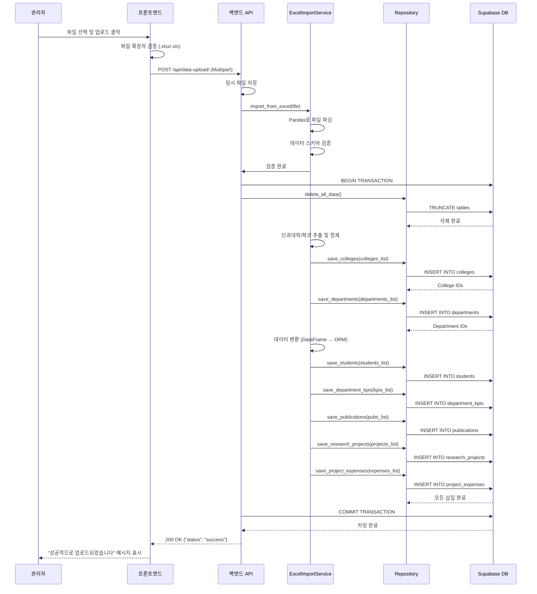

# 유스케이스 작성 템플릿

## 유스케이스 ID: UC-002

### 제목
관리자 데이터 업로드 - 엑셀 파일을 통한 대시보드 데이터 갱신

---

## 1. 개요

### 1.1 목적
관리자가 이카운트 시스템에서 추출한 대학 데이터(학생 명단, 학과 KPI, 연구 과제, 논문 목록 등)를 엑셀 파일 형식으로 시스템에 업로드하여 대시보드의 모든 데이터를 최신 상태로 갱신한다. 이를 통해 수동 데이터 입력의 번거로움을 제거하고, 데이터 기반 의사결정을 위한 최신 정보를 제공한다.

### 1.2 범위
- **포함**: 엑셀 파일(.xlsx, .xls) 업로드, 파일 형식 검증, 데이터 스키마 검증, 기존 데이터 삭제 및 신규 데이터 저장, 처리 결과 피드백
- **제외**:
  - 데이터 자동 연동 기능 (파일 감시 및 자동 동기화)
  - 데이터 업로드 내역 관리 (히스토리, 롤백 기능)
  - 엑셀 외 다른 형식(CSV, JSON 등)의 파일 업로드
  - 데이터 부분 업데이트 (항상 전체 데이터 교체)

### 1.3 액터
- **주요 액터**: 관리자 (Admin User) - 데이터 담당 교직원
- **부 액터**:
  - 백엔드 API 서버 (Django + DRF)
  - Supabase PostgreSQL 데이터베이스
  - 일반 사용자 (데이터 갱신 후 대시보드 조회)

---

## 2. 선행 조건

- 관리자가 시스템에 로그인되어 있으며, 관리자 권한(role: 'admin')을 보유해야 한다.
- 업로드할 엑셀 파일이 로컬 시스템에 준비되어 있어야 한다.
- 엑셀 파일이 정의된 데이터 스키마(컬럼명, 데이터 타입)를 준수해야 한다.
- 백엔드 API 서버와 데이터베이스가 정상 작동 중이어야 한다.

---

## 3. 참여 컴포넌트

- **프론트엔드 (React + Vite)**: 파일 업로드 UI 제공, 클라이언트 측 파일 확장자 검증, API 호출 및 결과 표시
- **백엔드 API (Django + DRF)**: 파일 수신, Pandas를 통한 파일 파싱, 데이터 검증, 데이터베이스 트랜잭션 처리
- **ExcelImportService**: 엑셀 파일 읽기, 데이터 정제 및 변환, 비즈니스 로직 처리
- **Repository Layer**: 데이터베이스 CRUD 작업 수행 (기존 데이터 삭제, 신규 데이터 삽입)
- **Supabase PostgreSQL**: 데이터 영속성 계층, 트랜잭션 관리
- **메인 대시보드**: 데이터 갱신 후 사이드 이펙트로 자동 갱신

---

## 4. 기본 플로우 (Basic Flow)

### 4.1 단계별 흐름

1. **[관리자]**: GNB(Global Navigation Bar)의 '데이터 관리' 메뉴를 클릭하여 '데이터 업로드 페이지'로 이동한다.
   - 입력: 없음
   - 처리: React Router를 통한 페이지 전환
   - 출력: 데이터 업로드 페이지 렌더링

2. **[관리자]**: '파일 선택' 버튼을 클릭하여 로컬 파일 탐색기를 연다.
   - 입력: 마우스 클릭
   - 처리: 브라우저의 파일 선택 다이얼로그 표시
   - 출력: 파일 선택 UI 표시

3. **[관리자]**: 유효한 엑셀 파일(.xlsx 또는 .xls)을 선택한다.
   - 입력: 엑셀 파일 경로
   - 처리: 파일 객체 생성
   - 출력: 선택된 파일명이 화면에 표시됨

4. **[프론트엔드]**: 선택된 파일의 확장자를 검증한다.
   - 입력: 파일 객체 (file.name)
   - 처리: 정규식 또는 확장자 추출을 통해 .xlsx, .xls 여부 확인
   - 출력: 검증 성공 시 '업로드' 버튼 활성화, 실패 시 오류 메시지 표시

5. **[관리자]**: '업로드' 버튼을 클릭한다.
   - 입력: 마우스 클릭
   - 처리: 업로드 프로세스 시작
   - 출력: 로딩 인디케이터 표시 (예: 스피너)

6. **[프론트엔드]**: 선택된 파일을 백엔드 API로 전송한다.
   - 입력: File 객체
   - 처리: FormData 객체 생성 후 Multipart/form-data 형식으로 POST 요청 (예: `/api/data-upload/`)
   - 출력: HTTP 요청 전송

7. **[백엔드 API]**: 업로드된 파일을 임시 저장소에 저장한다.
   - 입력: Multipart Request의 파일 데이터
   - 처리: Django의 `request.FILES`를 통해 임시 파일 저장
   - 출력: 임시 파일 경로 또는 파일 객체

8. **[ExcelImportService]**: Pandas를 사용하여 엑셀 파일을 메모리로 읽어들인다.
   - 입력: 임시 파일 경로
   - 처리: `pd.read_excel()` 호출, 각 시트별 DataFrame 생성 (예: student_roster, department_kpi, research_project_data, publication_list)
   - 출력: DataFrame 딕셔너리 (예: `{'students': df_students, 'department_kpis': df_kpis, ...}`)

9. **[ExcelImportService]**: 데이터 스키마 검증을 수행한다.
   - 입력: DataFrame 딕셔너리
   - 처리:
     - 필수 컬럼 존재 여부 확인 (예: '학번', '이름', '단과대학', '학과' 등)
     - 데이터 타입 검증 (예: '학년'은 숫자형, '이메일'은 문자열)
     - 빈 데이터(Empty DataFrame) 체크
     - 데이터 무결성 체크 (예: 외래 키 관계에 있는 '학과'가 유효한지)
   - 출력: 검증 성공 시 True, 실패 시 ValidationError 예외 발생

10. **[백엔드 API]**: 데이터베이스 트랜잭션을 시작한다.
    - 입력: 없음
    - 처리: `transaction.atomic()` 컨텍스트 진입
    - 출력: 트랜잭션 블록 시작

11. **[Repository Layer]**: 기존 데이터를 삭제한다.
    - 입력: 없음
    - 처리: 외래 키 제약 조건을 고려하여 순서대로 TRUNCATE 실행
      - `project_expenses` → `research_projects` → `publications` → `department_kpis` → `students` → `departments` → `colleges`
    - 출력: 모든 테이블의 데이터가 삭제됨

12. **[ExcelImportService]**: 엑셀 데이터에서 단과대학 및 학과 정보를 추출하고 중복 제거한다.
    - 입력: DataFrame 딕셔너리
    - 처리:
      - 모든 DataFrame에서 '단과대학', '학과' 컬럼 추출
      - `df.drop_duplicates()` 를 통해 중복 제거
      - 단과대학과 학과의 관계 매핑 생성
    - 출력: 정제된 단과대학 목록, 학과 목록 (학과는 소속 단과대학 정보 포함)

13. **[Repository Layer]**: 단과대학 데이터를 데이터베이스에 삽입한다.
    - 입력: 단과대학 목록 (예: ['공과대학', '인문대학', '사범대학'])
    - 처리: `colleges` 테이블에 `bulk_create()` 실행
    - 출력: 삽입된 College 객체 목록 (id 포함)

14. **[Repository Layer]**: 학과 데이터를 데이터베이스에 삽입한다.
    - 입력: 학과 목록 (소속 단과대학 id 매핑 포함)
    - 처리: `departments` 테이블에 `bulk_create()` 실행
    - 출력: 삽입된 Department 객체 목록 (id 포함)

15. **[ExcelImportService]**: 각 DataFrame의 데이터를 ORM 모델 인스턴스로 변환한다.
    - 입력: DataFrame 딕셔너리 및 단과대학/학과 id 매핑 정보
    - 처리:
      - 학생 데이터: '학과' 이름을 department_id로 변환
      - 학과 KPI: '단과대학', '학과' 이름을 department_id로 변환
      - 논문 목록: '학과' 이름을 department_id로 변환
      - 연구 과제: '학과' 이름을 department_id로 변환, 과제별로 `ResearchProject`와 `ProjectExpense` 분리
    - 출력: 모델 인스턴스 리스트 (예: `[Student(...), Student(...), ...]`)

16. **[Repository Layer]**: 변환된 데이터를 각 테이블에 삽입한다.
    - 입력: 모델 인스턴스 리스트
    - 처리: 각 테이블별로 `bulk_create()` 실행
      - `students` 테이블 삽입
      - `department_kpis` 테이블 삽입
      - `research_projects` 테이블 삽입
      - `project_expenses` 테이블 삽입 (연구 과제 id 참조)
      - `publications` 테이블 삽입
    - 출력: 각 테이블에 데이터 삽입 완료

17. **[백엔드 API]**: 트랜잭션을 커밋한다.
    - 입력: 없음
    - 처리: `transaction.atomic()` 블록 정상 종료
    - 출력: 모든 변경사항이 데이터베이스에 영구 반영됨

18. **[백엔드 API]**: 성공 응답을 클라이언트로 반환한다.
    - 입력: 처리 완료 상태
    - 처리: HTTP 200 OK 또는 201 Created 응답 생성
    - 출력: JSON 응답 (예: `{"status": "success", "message": "데이터가 성공적으로 업로드되었습니다."}`)

19. **[프론트엔드]**: 성공 메시지를 화면에 표시한다.
    - 입력: API 성공 응답
    - 처리: Toast 알림 또는 Alert 컴포넌트 렌더링
    - 출력: "성공적으로 업로드되었습니다" 메시지 표시

20. **[메인 대시보드]**: 사용자가 대시보드 페이지로 이동하면 새로운 데이터가 자동으로 반영된다.
    - 입력: 없음 (페이지 전환 시 자동)
    - 처리: 대시보드 API 재호출
    - 출력: 갱신된 차트 및 그래프 표시

### 4.2 시퀀스 다이어그램



---

## 5. 대안 플로우 (Alternative Flows)

### 5.1 대안 플로우 1: 파일 크기가 매우 큰 경우

**시작 조건**: 기본 플로우 6단계 (파일 전송) 시점

**단계**:
1. 프론트엔드는 파일 크기를 확인하여 설정된 제한(예: 10MB)을 초과할 경우 경고 메시지를 표시한다.
2. 관리자에게 "파일 크기가 너무 큽니다. 파일을 분할하거나 데이터를 줄여주세요." 메시지를 표시한다.
3. 업로드를 차단하고 기본 플로우를 종료한다.

**결과**: 업로드가 수행되지 않고, 관리자는 파일을 수정해야 한다.

---

## 6. 예외 플로우 (Exception Flows)

### 6.1 예외 상황 1: 잘못된 파일 형식 선택 (클라이언트 측)

**발생 조건**: 관리자가 엑셀 파일이 아닌 다른 형식(.pdf, .docx, .txt 등)의 파일을 선택한 경우

**처리 방법**:
1. 프론트엔드는 기본 플로우 4단계에서 파일 확장자를 검증한다.
2. 검증 실패 시, 즉시 오류 메시지를 표시하고 '업로드' 버튼을 비활성화한다.
3. 파일 선택을 초기화하고 사용자가 다시 선택할 수 있도록 한다.

**에러 코드**: 없음 (클라이언트 측에서 처리)

**사용자 메시지**: "엑셀 파일(.xlsx, .xls)만 업로드할 수 있습니다."

---

### 6.2 예외 상황 2: 데이터 스키마 불일치 (백엔드 측)

**발생 조건**: 엑셀 파일의 컬럼명이나 데이터 타입이 정의된 스키마와 다른 경우

**처리 방법**:
1. ExcelImportService는 기본 플로우 9단계에서 스키마 검증을 수행한다.
2. 검증 실패 시 `ValidationError` 예외를 발생시킨다.
3. 백엔드 API는 예외를 캐치하여 트랜잭션을 롤백한다. (데이터베이스 변경사항 없음)
4. 400 Bad Request 응답과 함께 상세한 오류 정보를 반환한다.
5. 프론트엔드는 오류 메시지를 사용자에게 표시한다.

**에러 코드**: `400 Bad Request`

**사용자 메시지**: "데이터 형식이 올바르지 않습니다. [구체적인 오류: 예: '학번' 컬럼이 누락되었습니다.]"

**상세 응답 예시**:
```json
{
  "status": "error",
  "message": "데이터 형식이 올바르지 않습니다.",
  "details": [
    "student_roster 시트: '학번' 컬럼이 누락되었습니다.",
    "department_kpi 시트: '평가년도' 컬럼의 데이터 타입이 올바르지 않습니다."
  ]
}
```

---

### 6.3 예외 상황 3: 빈 파일 또는 데이터 없음

**발생 조건**: 엑셀 파일은 정상이나 시트에 데이터가 없거나 헤더만 존재하는 경우

**처리 방법**:
1. ExcelImportService는 기본 플로우 9단계에서 DataFrame의 행(row) 수를 확인한다.
2. 데이터가 없을 경우 `ValidationError` 예외를 발생시킨다.
3. 백엔드 API는 트랜잭션을 시작하지 않고 400 Bad Request 응답을 반환한다.
4. 프론트엔드는 오류 메시지를 표시한다.

**에러 코드**: `400 Bad Request`

**사용자 메시지**: "파일에 처리할 데이터가 없습니다. 엑셀 파일에 데이터를 입력한 후 다시 시도해주세요."

---

### 6.4 예외 상황 4: 업로드 용량 초과 (서버 측)

**발생 조건**: 파일 크기가 서버에서 설정한 제한(예: Django의 `DATA_UPLOAD_MAX_MEMORY_SIZE`)을 초과한 경우

**처리 방법**:
1. Django 미들웨어가 기본 플로우 7단계 이전에 요청을 차단한다.
2. 413 Payload Too Large 응답을 반환한다.
3. 프론트엔드는 HTTP 상태 코드를 확인하여 적절한 오류 메시지를 표시한다.

**에러 코드**: `413 Payload Too Large`

**사용자 메시지**: "파일 크기가 너무 큽니다. 파일 크기를 줄이거나 데이터를 분할하여 다시 시도해주세요."

---

### 6.5 예외 상황 5: 데이터베이스 저장 중 오류

**발생 조건**: 기본 플로우 11~16단계에서 데이터베이스 연결 오류, 제약 조건 위반, 디스크 공간 부족 등의 예기치 않은 오류 발생

**처리 방법**:
1. Repository Layer에서 발생한 예외를 백엔드 API가 캐치한다.
2. 트랜잭션이 자동으로 롤백되어 모든 변경사항이 취소된다. (데이터 무결성 보장)
3. 500 Internal Server Error 응답을 반환한다.
4. 서버 로그에 상세한 오류 정보를 기록한다.
5. 프론트엔드는 일반적인 오류 메시지를 표시한다.

**에러 코드**: `500 Internal Server Error`

**사용자 메시지**: "데이터 처리 중 오류가 발생했습니다. 잠시 후 다시 시도해주시거나, 관리자에게 문의하세요."

**서버 로그 예시**:
```
[ERROR] 2025-11-13 14:32:15 - DatabaseError during data import
Traceback:
  ...
  psycopg2.errors.DiskFull: could not write to file: No space left on device
```

---

### 6.6 예외 상황 6: 파일 파싱 실패 (손상된 엑셀 파일)

**발생 조건**: 엑셀 파일이 손상되어 Pandas가 읽을 수 없는 경우

**처리 방법**:
1. ExcelImportService의 기본 플로우 8단계에서 `pd.read_excel()`이 예외를 발생시킨다.
2. 백엔드 API는 예외를 캐치하여 400 Bad Request 응답을 반환한다.
3. 프론트엔드는 오류 메시지를 표시한다.

**에러 코드**: `400 Bad Request`

**사용자 메시지**: "엑셀 파일을 읽을 수 없습니다. 파일이 손상되었거나 올바른 형식이 아닙니다."

---

### 6.7 예외 상황 7: 권한 없는 사용자의 접근 시도

**발생 조건**: 일반 사용자(role: 'general')가 데이터 업로드 API를 호출하려는 경우

**처리 방법**:
1. 백엔드 API는 인증 미들웨어 또는 권한 검사 로직을 통해 사용자 권한을 확인한다.
2. 권한이 없을 경우 403 Forbidden 응답을 반환한다.
3. 프론트엔드는 권한 오류 메시지를 표시하거나 데이터 업로드 페이지 자체를 숨긴다.

**에러 코드**: `403 Forbidden`

**사용자 메시지**: "이 기능은 관리자만 사용할 수 있습니다."

---

### 6.8 예외 상황 8: 네트워크 오류 (서버 연결 불가)

**발생 조건**: 프론트엔드가 기본 플로우 6단계에서 API 요청을 보냈으나 서버가 응답하지 않는 경우

**처리 방법**:
1. Axios 또는 Fetch API가 네트워크 오류 예외를 발생시킨다.
2. 프론트엔드는 catch 블록에서 예외를 처리한다.
3. 재시도 로직을 제공하거나 일반적인 네트워크 오류 메시지를 표시한다.

**에러 코드**: 없음 (네트워크 레벨 오류)

**사용자 메시지**: "서버에 연결할 수 없습니다. 네트워크 연결을 확인한 후 다시 시도해주세요."

---

## 7. 후행 조건 (Post-conditions)

### 7.1 성공 시

- **데이터베이스 변경**:
  - `colleges`, `departments`, `students`, `department_kpis`, `publications`, `research_projects`, `project_expenses` 테이블의 모든 데이터가 새로운 데이터로 완전히 교체됨
  - 기존 데이터는 완전히 삭제되고, 엑셀 파일의 모든 데이터가 정확히 저장됨
- **시스템 상태**:
  - 대시보드에서 조회되는 모든 데이터가 최신 상태로 갱신됨
  - 사용자가 메인 대시보드를 다시 방문하면 새로운 데이터를 기반으로 한 차트가 표시됨
- **외부 시스템**: 해당 없음 (외부 API 연동 없음)

### 7.2 실패 시

- **데이터 롤백**:
  - 트랜잭션이 롤백되어 데이터베이스 상태가 업로드 시도 이전과 동일하게 유지됨
  - 부분적인 데이터 삽입이 발생하지 않음 (All or Nothing)
- **시스템 상태**:
  - 기존 데이터가 그대로 유지되며, 대시보드는 이전 데이터를 계속 표시함
  - 관리자에게 오류 메시지가 표시되어 재시도 가능

---

## 8. 비기능 요구사항

### 8.1 성능
- 파일 업로드부터 데이터베이스 저장 완료까지 **30초 이내** 처리 (일반적인 데이터 규모 기준: 학생 1,000명, 논문 100건 등)
- 대용량 파일(5MB 이상) 업로드 시 진행률 표시를 통해 사용자 경험 개선
- 데이터베이스 `bulk_create()` 사용으로 대량 삽입 성능 최적화

### 8.2 보안
- 업로드 API 엔드포인트는 **관리자 권한을 가진 인증된 사용자만** 접근 가능
- Supabase Auth를 통해 발급된 JWT 토큰으로 인증 검증
- 파일 확장자 화이트리스트 방식으로 악성 파일 업로드 차단 (.xlsx, .xls만 허용)
- HTTPS 프로토콜을 통한 파일 전송으로 중간자 공격 방지

### 8.3 가용성
- 데이터 업로드 실패 시 기존 데이터를 손상시키지 않음 (트랜잭션 보장)
- 업로드 중 서버 오류 발생 시에도 데이터 무결성 유지
- 데이터베이스 연결 오류 시 자동 재시도 로직 (Retry 메커니즘)

### 8.4 확장성
- 향후 다중 파일 업로드 지원을 위한 아키텍처 확장 가능성 고려
- 엑셀 외 CSV, JSON 등 다른 형식 지원을 위한 파서 인터페이스 설계

---

## 9. UI/UX 요구사항

### 9.1 화면 구성

**데이터 업로드 페이지 필수 UI 요소**:
1. **페이지 제목**: "데이터 업로드" 또는 "데이터 관리"
2. **파일 선택 영역**:
   - "파일 선택" 버튼 (또는 드래그 앤 드롭 영역)
   - 선택된 파일명 표시 텍스트
   - 지원 형식 안내 문구: "Excel 파일(.xlsx, .xls)만 지원됩니다."
3. **업로드 버튼**:
   - 파일이 선택되지 않았을 때: 비활성화 상태
   - 파일이 선택되었을 때: 활성화 상태
4. **로딩 인디케이터**:
   - 업로드 중일 때 스피너 또는 프로그레스 바 표시
   - "데이터를 처리 중입니다. 잠시만 기다려주세요." 메시지
5. **피드백 메시지 영역**:
   - 성공 시: 녹색 배경의 성공 메시지 (Toast 또는 Alert)
   - 실패 시: 빨간색 배경의 오류 메시지 (상세 오류 내용 포함)
6. **대시보드로 이동 링크**:
   - "업로드한 데이터 확인하기" 버튼 (메인 대시보드로 이동)

### 9.2 사용자 경험

1. **파일 선택 편의성**:
   - 드래그 앤 드롭 방식 지원 권장 (파일 탐색기에서 바로 끌어다 놓기)
   - 파일 선택 후 파일명과 크기를 명확하게 표시
2. **즉각적인 피드백**:
   - 파일 선택 즉시 클라이언트 측 검증 수행 (확장자, 크기)
   - 검증 실패 시 업로드 버튼 클릭 이전에 오류 메시지 표시
3. **처리 진행 상황 시각화**:
   - 업로드 및 처리 중 로딩 애니메이션 표시
   - 가능하면 단계별 진행 상황 표시 (예: "파일 업로드 중 → 데이터 검증 중 → 저장 중")
4. **명확한 오류 안내**:
   - 오류 발생 시 기술적 용어보다는 사용자가 이해하기 쉬운 문구 사용
   - 해결 방법 제시 (예: "데이터 형식을 확인하고 다시 시도해주세요.")
5. **성공 후 다음 액션 유도**:
   - 업로드 성공 후 "대시보드에서 확인하기" 버튼을 통해 자연스러운 워크플로우 유도

---

## 10. 테스트 시나리오

### 10.1 성공 케이스

| 테스트 케이스 ID | 입력값 | 기대 결과 |
|----------------|--------|----------|
| TC-002-01 | 유효한 student_roster.xlsx 파일 (정상 데이터 포함) | 파일 업로드 성공, "성공적으로 업로드되었습니다" 메시지 표시, students 테이블에 데이터 정상 삽입 |
| TC-002-02 | 4개 시트를 모두 포함한 통합 엑셀 파일 | 모든 테이블(colleges, departments, students, department_kpis, publications, research_projects, project_expenses)에 데이터 정상 삽입 |
| TC-002-03 | 기존 데이터가 있는 상태에서 새로운 엑셀 파일 업로드 | 기존 데이터 완전 삭제 후 새 데이터로 교체됨, 대시보드 갱신 확인 |
| TC-002-04 | 매우 작은 데이터 (학생 5명, 논문 2건) | 정상 처리, 응답 시간 2초 이내 |

### 10.2 실패 케이스

| 테스트 케이스 ID | 입력값 | 기대 결과 |
|----------------|--------|----------|
| TC-002-05 | .pdf 파일 선택 | 클라이언트 측에서 "엑셀 파일만 업로드할 수 있습니다." 오류 메시지, 업로드 버튼 비활성화 |
| TC-002-06 | 필수 컬럼 '학번' 누락된 엑셀 파일 | 400 Bad Request, "데이터 형식이 올바르지 않습니다. '학번' 컬럼이 누락되었습니다." 메시지 표시 |
| TC-002-07 | 데이터가 없는 빈 엑셀 파일 | 400 Bad Request, "파일에 처리할 데이터가 없습니다." 메시지 표시 |
| TC-002-08 | 손상된 .xlsx 파일 | 400 Bad Request, "엑셀 파일을 읽을 수 없습니다. 파일이 손상되었거나 올바른 형식이 아닙니다." 메시지 표시 |
| TC-002-09 | 파일 크기 제한 초과 (예: 15MB) | 413 Payload Too Large 또는 클라이언트 측에서 "파일 크기가 너무 큽니다." 메시지 표시 |
| TC-002-10 | 일반 사용자(role: 'general')가 업로드 시도 | 403 Forbidden, "이 기능은 관리자만 사용할 수 있습니다." 메시지 표시 |
| TC-002-11 | 데이터베이스 연결 오류 상황 시뮬레이션 | 500 Internal Server Error, "데이터 처리 중 오류가 발생했습니다." 메시지 표시, 기존 데이터 유지 확인 |
| TC-002-12 | 네트워크 오류 (서버 오프라인 상태) | 프론트엔드에서 "서버에 연결할 수 없습니다." 메시지 표시 |

### 10.3 엣지 케이스

| 테스트 케이스 ID | 입력값 | 기대 결과 |
|----------------|--------|----------|
| TC-002-13 | 동일한 파일을 연속으로 2번 업로드 | 두 번째 업로드도 정상 처리, 결과적으로 동일한 데이터가 데이터베이스에 저장됨 |
| TC-002-14 | 외래 키 관계 위반 데이터 (존재하지 않는 학과명) | 400 Bad Request, "학과 정보가 올바르지 않습니다." 또는 검증 단계에서 오류 |
| TC-002-15 | 매우 긴 텍스트 데이터 (예: 논문 제목 1000자) | 데이터베이스 컬럼 길이 제한을 초과하면 오류 발생, 적절한 오류 메시지 표시 |
| TC-002-16 | 날짜 형식 오류 (예: '2025-13-01') | 400 Bad Request, "날짜 형식이 올바르지 않습니다." 메시지 표시 |

---

## 11. 관련 유스케이스

- **선행 유스케이스**:
  - UC-001: 로그인 (관리자가 시스템에 로그인해야 데이터 업로드 페이지에 접근 가능)
- **후행 유스케이스**:
  - UC-003: 메인 대시보드 조회 (데이터 업로드 후 대시보드에서 갱신된 데이터를 확인)
- **연관 유스케이스**:
  - UC-004 ~ UC-N: 개별 차트 조회 (업로드된 데이터를 기반으로 다양한 차트 렌더링)

---

## 12. 변경 이력

| 버전 | 날짜 | 작성자 | 변경 내용 |
|------|------|--------|-----------|
| 1.0  | 2025-11-13 | CTO | 초기 작성 - MVP 범위 내 엑셀 파일 업로드 유스케이스 정의 |

---

## 부록

### A. 용어 정의

- **이카운트(Ecount)**: 대학에서 사용 중인 기존 데이터 관리 시스템
- **Pandas**: Python 기반 데이터 분석 라이브러리, 엑셀 파일 파싱 및 데이터 처리에 사용
- **bulk_create()**: Django ORM의 대량 데이터 삽입 메소드, 성능 최적화를 위해 사용
- **TRUNCATE**: SQL 명령어로, 테이블의 모든 데이터를 빠르게 삭제 (DELETE보다 빠름)
- **트랜잭션(Transaction)**: 데이터베이스 작업의 원자성(All or Nothing)을 보장하는 단위
- **ValidationError**: 데이터 검증 실패 시 발생하는 예외
- **Multipart/form-data**: 파일 업로드를 위한 HTTP Content-Type

### B. 참고 자료

- **프로젝트 문서**:
  - `/docs/prd.md`: 제품 요구사항 정의서 (PRD)
  - `/docs/userflow.md`: 사용자 여정 정의 (Section 2.1 참조)
  - `/docs/database.md`: 데이터베이스 스키마 정의
  - `/docs/structure.md`: 백엔드 아키텍처 (Layered Architecture 및 Repository Pattern)
- **입력 데이터 형식**:
  - `/docs/input_data/student_roster.csv`: 학생 명단 샘플
  - `/docs/input_data/department_kpi.csv`: 학과 KPI 샘플
  - `/docs/input_data/research_project_data.csv`: 연구 과제 및 집행 내역 샘플
  - `/docs/input_data/publication_list.csv`: 논문 목록 샘플
- **기술 스택 문서**:
  - `/docs/techstack.md`: Django + DRF, Pandas, Supabase 기술 선택 배경
- **Django 공식 문서**:
  - [File Uploads](https://docs.djangoproject.com/en/stable/topics/http/file-uploads/)
  - [Database Transactions](https://docs.djangoproject.com/en/stable/topics/db/transactions/)
- **Pandas 공식 문서**:
  - [read_excel()](https://pandas.pydata.org/docs/reference/api/pandas.read_excel.html)
