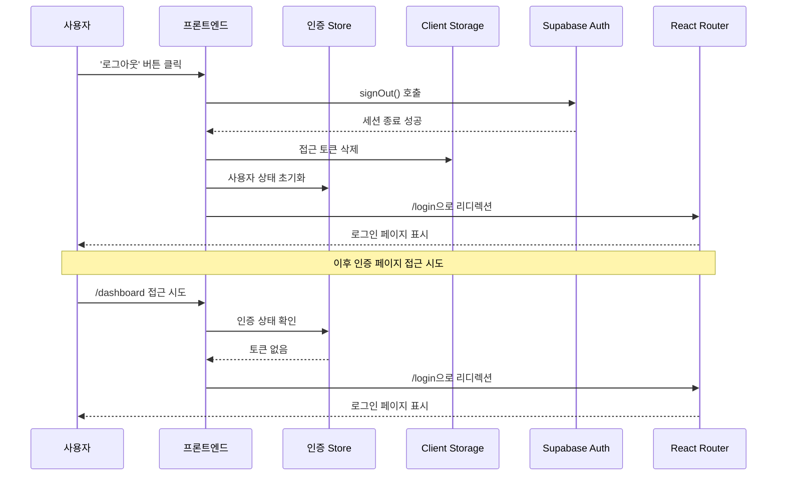

# 유스케이스 작성 템플릿

## 유스케이스 ID: UC-002

### 제목
사용자 로그아웃

---

## 1. 개요

### 1.1 목적
인증된 사용자가 시스템에서 안전하게 로그아웃하여 세션을 종료하고, 더 이상 인증이 필요한 페이지에 접근할 수 없도록 합니다.

### 1.2 범위
- 사용자의 클라이언트 측 인증 토큰 삭제
- 사용자 세션 종료
- 로그인 페이지로의 리디렉션
- 인증 페이지 접근 제어

**제외 사항**:
- 서버 측 토큰 무효화 (Supabase Auth의 기본 세션 관리 기능 활용)
- 다중 디바이스 로그아웃

### 1.3 액터
- **주요 액터**: 인증된 사용자 (관리자 또는 일반 사용자)
- **부 액터**:
  - 프론트엔드 애플리케이션
  - Supabase Auth 서비스

---

## 2. 선행 조건

- 사용자가 이미 로그인되어 있어야 함 (유효한 접근 토큰 보유)
- 사용자가 인증이 필요한 페이지(메인 대시보드, 데이터 업로드)에 접근 가능한 상태
- 헤더(GNB)에 '로그아웃' 버튼이 표시되어 있음

---

## 3. 참여 컴포넌트

- **프론트엔드 (React)**: 로그아웃 버튼 렌더링 및 클릭 이벤트 처리, 토큰 삭제, 페이지 리디렉션
- **클라이언트 스토리지**: 접근 토큰 저장소 (LocalStorage 또는 SessionStorage)
- **인증 상태 관리 (Store)**: 전역 인증 상태 업데이트
- **Supabase Auth**: 세션 종료 처리
- **라우터 (React Router)**: 로그인 페이지로의 리디렉션
- **인증 가드 (Route Guard)**: 인증 페이지 접근 제어

---

## 4. 기본 플로우 (Basic Flow)

### 4.1 단계별 흐름

1. **[사용자]**: 헤더(GNB)의 '로그아웃' 버튼을 클릭
   - 입력: 로그아웃 버튼 클릭 이벤트
   - 처리: 없음
   - 출력: 클릭 이벤트 발생

2. **[프론트엔드]**: 로그아웃 핸들러 함수 실행
   - 입력: 로그아웃 요청
   - 처리: Supabase Auth의 `signOut()` 메서드 호출
   - 출력: 로그아웃 요청을 Supabase로 전송

3. **[Supabase Auth]**: 세션 종료 처리
   - 입력: 로그아웃 요청
   - 처리: 서버 측 세션 무효화
   - 출력: 세션 종료 성공 응답

4. **[프론트엔드]**: 클라이언트 측 인증 정보 삭제
   - 입력: Supabase 응답
   - 처리:
     - LocalStorage/SessionStorage에서 접근 토큰 삭제
     - 전역 상태 관리 스토어의 사용자 정보 초기화
   - 출력: 클라이언트 측 인증 정보 완전 삭제

5. **[프론트엔드]**: 로그인 페이지로 리디렉션
   - 입력: 로그아웃 완료 상태
   - 처리: React Router를 통해 `/login` 경로로 이동
   - 출력: 로그인 페이지 렌더링

6. **[인증 가드]**: 인증 페이지 접근 차단
   - 입력: 없음 (백그라운드 동작)
   - 처리: 인증 토큰이 없으므로 `/dashboard`, `/upload` 등의 경로 접근 시 자동으로 로그인 페이지로 리디렉션
   - 출력: 보호된 페이지 접근 불가

### 4.2 시퀀스 다이어그램

---

## 5. 대안 플로우 (Alternative Flows)

### 5.1 대안 플로우 1: 세션 만료 상태에서 로그아웃

**시작 조건**: 사용자의 세션이 이미 만료된 상태에서 로그아웃 버튼 클릭

**단계**:
1. 사용자가 '로그아웃' 버튼 클릭
2. 프론트엔드가 Supabase Auth에 로그아웃 요청
3. Supabase는 이미 만료된 세션임을 응답하지만 정상 처리
4. 클라이언트 측 토큰 삭제 및 로그인 페이지로 리디렉션

**결과**: 기본 플로우와 동일하게 로그아웃 완료

---

## 6. 예외 플로우 (Exception Flows)

### 6.1 예외 상황 1: 네트워크 오류로 Supabase 연결 실패

**발생 조건**: 로그아웃 요청 중 네트워크 오류 또는 Supabase 서버 응답 없음

**처리 방법**:
1. 프론트엔드는 Supabase 요청 실패를 감지
2. 그럼에도 불구하고 클라이언트 측 토큰 삭제 진행 (보안 우선)
3. 전역 상태 초기화
4. 로그인 페이지로 리디렉션
5. 사용자에게 "로그아웃 중 오류가 발생했지만 안전하게 로그아웃되었습니다" 메시지 표시 (선택적)

**에러 코드**: 클라이언트 측 처리 (HTTP 에러 아님)

**사용자 메시지**: "로그아웃되었습니다" (네트워크 오류 상세 내용은 숨김)

### 6.2 예외 상황 2: 이미 로그아웃된 상태에서 로그아웃 시도

**발생 조건**: 다른 탭 또는 디바이스에서 이미 로그아웃되어 토큰이 무효화된 상태

**처리 방법**:
1. 프론트엔드는 토큰이 없음을 확인
2. 이미 로그아웃 상태이므로 추가 처리 없이 로그인 페이지로 리디렉션
3. 에러 메시지 없이 정상 플로우로 처리

**에러 코드**: 없음 (정상 동작)

**사용자 메시지**: 별도 메시지 없음

---

## 7. 후행 조건 (Post-conditions)

### 7.1 성공 시

- **클라이언트 스토리지 변경**:
  - 접근 토큰이 LocalStorage/SessionStorage에서 완전히 삭제됨
  - Supabase 세션 정보 삭제
- **시스템 상태**:
  - 사용자의 인증 상태가 "비인증" 으로 변경
  - 전역 상태 관리 스토어의 사용자 정보 초기화 (null 또는 undefined)
- **외부 시스템**:
  - Supabase Auth에서 해당 사용자의 세션이 무효화됨
- **UI 상태**:
  - 사용자가 로그인 페이지에 위치
  - 인증이 필요한 페이지에 접근 시 자동으로 로그인 페이지로 리디렉션됨

### 7.2 실패 시

- **데이터 롤백**: 해당 없음 (데이터베이스 변경 없음)
- **시스템 상태**:
  - 네트워크 오류 시에도 클라이언트 측 토큰은 삭제되어 로그아웃 완료 상태
  - 사용자는 로그인 페이지로 이동

---

## 8. 비기능 요구사항

### 8.1 성능
- 로그아웃 버튼 클릭부터 로그인 페이지 표시까지 1초 이내 완료
- 네트워크 오류 시에도 클라이언트 측 처리는 즉시 완료 (타임아웃 설정: 3초)

### 8.2 보안
- 로그아웃 시 클라이언트 측 모든 인증 정보 완전 삭제
- 토큰 삭제 후 브라우저 히스토리를 통한 보호된 페이지 복귀 차단
- 로그아웃 후 브라우저 뒤로가기 시에도 인증 페이지 접근 불가 (인증 가드 동작)
- Supabase 요청 실패 시에도 클라이언트 측 정보는 반드시 삭제

### 8.3 가용성
- 네트워크 오류와 무관하게 클라이언트 측 로그아웃은 항상 성공
- 모든 브라우저 환경에서 일관된 동작 보장

---

## 9. UI/UX 요구사항

### 9.1 화면 구성
- **헤더(GNB)**:
  - '로그아웃' 버튼이 명확하게 표시되어야 함
  - 버튼 위치: 헤더 우측 상단 영역
  - 버튼 스타일: 다른 주요 액션과 구분되는 시각적 스타일

- **로그인 페이지**:
  - 리디렉션 후 즉시 표시
  - 선택적으로 "로그아웃되었습니다" 알림 메시지 표시 (3초 후 자동 사라짐)

### 9.2 사용자 경험
- 로그아웃 버튼 클릭 시 즉각적인 피드백 (로딩 스피너 또는 버튼 비활성화)
- 로그아웃 과정은 빠르고 방해받지 않음 (확인 모달 없음)
- 로그아웃 후 인증 페이지 접근 시도 시 자연스럽게 로그인 페이지로 이동
- 에러 발생 시에도 사용자는 로그아웃 완료로 인지 (혼란 최소화)

---

## 10. 테스트 시나리오

### 10.1 성공 케이스

| 테스트 케이스 ID | 입력값 | 기대 결과 |
|----------------|--------|----------|
| TC-002-01      | 로그인된 관리자가 로그아웃 버튼 클릭 | 로그인 페이지로 이동, 토큰 삭제 완료 |
| TC-002-02      | 로그인된 일반 사용자가 로그아웃 버튼 클릭 | 로그인 페이지로 이동, 토큰 삭제 완료 |
| TC-002-03      | 로그아웃 후 /dashboard 접근 시도 | 자동으로 로그인 페이지로 리디렉션 |
| TC-002-04      | 로그아웃 후 /upload 접근 시도 | 자동으로 로그인 페이지로 리디렉션 |
| TC-002-05      | 로그아웃 후 브라우저 뒤로가기 | 보호된 페이지 표시 안됨, 로그인 페이지로 리디렉션 |

### 10.2 실패 케이스

| 테스트 케이스 ID | 입력값 | 기대 결과 |
|----------------|--------|----------|
| TC-002-06      | 네트워크 오프라인 상태에서 로그아웃 | 클라이언트 측 토큰 삭제, 로그인 페이지 이동 |
| TC-002-07      | Supabase 서버 다운 상태에서 로그아웃 | 클라이언트 측 토큰 삭제, 로그인 페이지 이동 |
| TC-002-08      | 이미 만료된 세션으로 로그아웃 | 정상적으로 로그인 페이지 이동 |
| TC-002-09      | 토큰이 이미 삭제된 상태에서 로그아웃 | 로그인 페이지 이동, 에러 없음 |

---

## 11. 관련 유스케이스

- **선행 유스케이스**: UC-001 (사용자 로그인)
- **후행 유스케이스**: UC-001 (사용자 재로그인)
- **연관 유스케이스**:
  - UC-003 (메인 대시보드 조회) - 로그아웃 후 접근 불가
  - UC-004 (데이터 업로드) - 로그아웃 후 접근 불가

---

## 12. 변경 이력

| 버전 | 날짜 | 작성자 | 변경 내용 |
|------|------|--------|-----------|
| 1.0  | 2025-11-13 | CTO | 초기 작성 |

---

## 부록

### A. 용어 정의
- **접근 토큰 (Access Token)**: 사용자 인증을 증명하는 클라이언트 측에 저장된 토큰
- **세션 (Session)**: 사용자의 로그인 상태를 나타내는 서버 측 상태
- **GNB (Global Navigation Bar)**: 전역 네비게이션 바, 헤더
- **인증 가드 (Route Guard)**: 인증되지 않은 사용자의 보호된 페이지 접근을 차단하는 라우팅 로직

### B. 참고 자료
- Supabase Auth Documentation: https://supabase.com/docs/guides/auth
- React Router v6 Documentation: https://reactrouter.com/
- 프로젝트 PRD 문서: `/docs/prd.md`
- 프로젝트 User Flow 문서: `/docs/userflow.md` (섹션 1.2)
