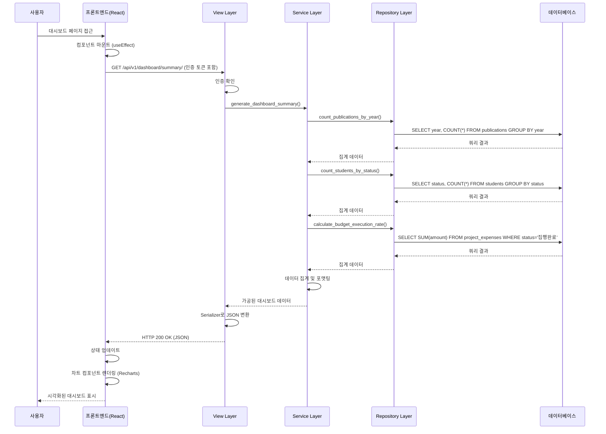

# 유스케이스 작성 템플릿

## 유스케이스 ID: UC-003

### 제목
메인 대시보드 데이터 조회 및 시각화

---

## 1. 개요

### 1.1 목적
사용자가 대학교의 핵심 성과 지표(실적, 논문, 학생 수, 예산 등)를 직관적인 차트 형태로 확인할 수 있도록 메인 대시보드 페이지에서 데이터를 조회하고 시각화하는 것이 목적입니다.

### 1.2 범위
- 메인 대시보드 페이지 진입 시 자동으로 대시보드 데이터 API 호출
- 백엔드에서 집계 및 가공된 데이터를 차트에 적합한 형태로 제공
- 프론트엔드에서 Recharts 라이브러리를 사용하여 다양한 차트(막대, 라인, 파이 등) 렌더링
- 데이터가 없거나 API 호출 실패 시 적절한 안내 메시지 표시

**범위 제외**:
- 차트 데이터 필터링 및 정렬 기능
- 차트 데이터 상세 드릴다운 기능
- 데이터 다운로드 기능

### 1.3 액터
- **주요 액터**: 인증된 사용자 (일반 사용자 및 관리자)
- **부 액터**: 백엔드 API 서버, 데이터베이스(Supabase PostgreSQL)

---

## 2. 선행 조건

- 사용자가 로그인하여 유효한 인증 토큰(Access Token)을 보유하고 있어야 합니다.
- 데이터베이스에 시각화할 데이터가 존재해야 합니다. (최소한의 데이터라도 있어야 의미 있는 차트 표시 가능)

---

## 3. 참여 컴포넌트

- **프론트엔드 (React)**:
  - 역할: 메인 대시보드 페이지를 렌더링하고, API를 호출하여 데이터를 받아 차트 라이브러리에 전달
  - 주요 컴포넌트: `DashboardPage.jsx`, `api/dashboardAPI.js`, `components/charts/*`

- **백엔드 (Django + DRF)**:
  - 역할: 데이터베이스에서 필요한 데이터를 조회하고, 차트 형식에 맞게 집계 및 가공하여 JSON 응답 제공
  - 주요 컴포넌트: `dashboard/views.py` (Presentation Layer), `dashboard/services/summary_generator.py` (Business Logic Layer), `dashboard/repositories.py` (Data Access Layer)

- **데이터베이스 (Supabase PostgreSQL)**:
  - 역할: 학생, 논문, 연구 과제, 학과 KPI 등의 데이터를 저장하고 조회 쿼리에 응답
  - 주요 테이블: `students`, `publications`, `research_projects`, `project_expenses`, `department_kpis`, `departments`, `colleges`

---

## 4. 기본 플로우 (Basic Flow)

### 4.1 단계별 흐름

1. **[사용자]**: 로그인 성공 후 자동으로 메인 대시보드 페이지로 이동하거나, GNB(Global Navigation Bar)에서 '대시보드' 메뉴를 클릭하여 메인 대시보드 페이지로 이동합니다.
   - 입력: 페이지 라우팅 액션
   - 처리: React Router가 `/dashboard` 경로로 라우팅
   - 출력: `DashboardPage` 컴포넌트 마운트

2. **[프론트엔드]**: `DashboardPage` 컴포넌트의 `useEffect` 훅이 실행되어 페이지 로드 시 대시보드 데이터 조회 API를 호출합니다.
   - 입력: 컴포넌트 마운트 이벤트
   - 처리: `api/dashboardAPI.js`의 `getDashboardData()` 함수 호출
   - 출력: HTTP GET 요청 전송 (`/api/v1/dashboard/summary/`)

3. **[백엔드 - Presentation Layer]**: `dashboard/views.py`의 `DashboardSummaryView`가 요청을 받습니다.
   - 입력: HTTP GET 요청 (인증 토큰 포함)
   - 처리:
     - 인증 미들웨어를 통해 사용자 인증 확인
     - `SummaryGeneratorService` 인스턴스 생성 및 필요한 Repository 주입
     - `service.generate_dashboard_summary()` 메소드 호출
   - 출력: Service Layer로 제어 이동

4. **[백엔드 - Business Logic Layer]**: `services/summary_generator.py`의 `SummaryGeneratorService`가 대시보드에 표시할 데이터를 생성합니다.
   - 입력: Service 메소드 호출
   - 처리:
     - Repository를 통해 각 차트에 필요한 데이터 조회
     - **종합 실적 현황**: 학과별 주요 지표 집계 (논문 수, 과제 수, 학생 수 등)
     - **논문 게재 수 추이**: 연도별 논문 게재 수 집계
     - **재학생/신입생 비율**: 학적 상태별 학생 수 집계
     - **예산 집행률**: 총 연구비 대비 집행 금액 집계
     - 각 차트 형식(막대, 라인, 파이)에 맞는 데이터 구조로 포맷팅
   - 출력: 가공된 데이터 딕셔너리 반환

5. **[백엔드 - Data Access Layer]**: `repositories.py`의 각 Repository가 데이터베이스 쿼리를 실행합니다.
   - 입력: Repository 메소드 호출 (예: `publication_repo.count_by_year()`)
   - 처리: Django ORM을 사용하여 데이터베이스 쿼리 실행 (JOIN, GROUP BY, COUNT 등)
   - 출력: 조회된 QuerySet 또는 집계 결과 반환

6. **[데이터베이스]**: PostgreSQL이 쿼리를 실행하고 결과를 반환합니다.
   - 입력: SQL 쿼리 (JOIN, GROUP BY, COUNT, SUM 등)
   - 처리: 인덱스를 활용한 효율적인 쿼리 실행
   - 출력: 쿼리 결과셋 반환

7. **[백엔드 - Presentation Layer]**: View가 Service의 결과를 받아 Serializer를 통해 JSON으로 직렬화하고 HTTP 응답을 생성합니다.
   - 입력: Service Layer의 데이터 딕셔너리
   - 처리: `DashboardSummarySerializer`로 데이터 직렬화
   - 출력: HTTP 200 OK 응답 (JSON 형식)

8. **[프론트엔드]**: API 응답을 수신하고 상태(state)를 업데이트합니다.
   - 입력: HTTP 응답 (JSON 데이터)
   - 처리:
     - 응답 데이터를 파싱
     - React 상태 업데이트 (`setDashboardData(response.data)`)
   - 출력: 컴포넌트 리렌더링 트리거

9. **[프론트엔드]**: 차트 컴포넌트들이 받은 데이터를 Recharts 라이브러리를 사용하여 시각화합니다.
   - 입력: 상태에 저장된 차트 데이터
   - 처리:
     - 각 차트 타입(BarChart, LineChart, PieChart)에 맞는 컴포넌트 렌더링
     - Recharts에 데이터 전달 및 차트 옵션 설정
   - 출력: 시각화된 차트들이 화면에 표시됨

10. **[사용자]**: 메인 대시보드 페이지에서 시각화된 핵심 지표들을 확인합니다.
    - 입력: 렌더링된 대시보드 화면
    - 처리: 차트를 통해 데이터 인사이트 확인
    - 출력: 의사결정에 필요한 정보 획득

### 4.2 시퀀스 다이어그램



---

## 5. 대안 플로우 (Alternative Flows)

### 5.1 대안 플로우 1: 특정 차트 데이터만 없는 경우

데이터베이스에 일부 데이터는 있지만, 특정 차트(예: 논문 데이터)가 없는 경우입니다.

**시작 조건**: 백엔드에서 특정 차트 데이터 조회 시 빈 결과셋 반환

**단계**:
1. Service Layer가 특정 데이터 조회 시 빈 배열 또는 0 값을 받음
2. Service는 해당 차트 데이터를 빈 배열 또는 기본값으로 설정
3. 백엔드는 다른 차트 데이터와 함께 응답 (HTTP 200 OK)
4. 프론트엔드는 정상적으로 데이터를 수신하고 차트 렌더링 시도
5. 해당 차트 컴포넌트는 데이터가 없음을 감지하고 "해당 데이터가 없습니다" 메시지 표시
6. 다른 차트는 정상적으로 표시됨

**결과**: 사용자는 일부 차트만 보게 되고, 데이터가 없는 차트 영역에는 안내 메시지가 표시됨

---

## 6. 예외 플로우 (Exception Flows)

### 6.1 예외 상황 1: 데이터베이스에 데이터가 전혀 없는 경우

**발생 조건**: 관리자가 아직 엑셀 파일을 업로드하지 않아 데이터베이스의 모든 데이터 테이블이 비어있는 경우

**처리 방법**:
1. Repository Layer에서 모든 테이블 조회 시 빈 QuerySet 반환
2. Service Layer에서 모든 차트 데이터가 비어있음을 확인
3. Service는 빈 데이터 구조를 반환하되, `is_empty: true` 플래그 포함
4. View는 HTTP 200 OK 응답 반환 (에러가 아닌 정상 상태)
5. 프론트엔드는 `is_empty` 플래그를 확인
6. 대시보드 영역에 "표시할 데이터가 없습니다. 관리자가 데이터를 업로드해야 합니다." 메시지 표시

**에러 코드**: 해당 없음 (정상 응답, HTTP 200 OK)

**사용자 메시지**: "표시할 데이터가 없습니다. 관리자가 데이터를 업로드해야 합니다."

### 6.2 예외 상황 2: API 호출 실패 (네트워크 오류)

**발생 조건**: 사용자의 네트워크 연결 불안정 또는 서버가 응답하지 않는 경우

**처리 방법**:
1. 프론트엔드의 API 호출 함수에서 네트워크 예외 발생
2. `try-catch` 블록에서 예외 캡처
3. 에러 상태를 React 상태에 저장 (`setError(true)`)
4. 대시보드 영역에 "데이터를 불러오는 데 실패했습니다." 오류 메시지 및 재시도 버튼 표시
5. 사용자가 재시도 버튼 클릭 시 API 호출 재시도

**에러 코드**: Network Error (프론트엔드 수준)

**사용자 메시지**: "데이터를 불러오는 데 실패했습니다. 잠시 후 다시 시도해주세요."

### 6.3 예외 상황 3: 인증 토큰 만료

**발생 조건**: 사용자의 인증 토큰이 만료되어 API 호출 시 401 Unauthorized 응답 수신

**처리 방법**:
1. 백엔드의 인증 미들웨어에서 토큰 검증 실패
2. HTTP 401 Unauthorized 응답 반환
3. 프론트엔드의 Axios Interceptor에서 401 응답 감지
4. 자동으로 로그인 페이지로 리다이렉트
5. "세션이 만료되었습니다. 다시 로그인해주세요." 메시지 표시

**에러 코드**: `HTTP 401 Unauthorized`

**사용자 메시지**: "세션이 만료되었습니다. 다시 로그인해주세요."

### 6.4 예외 상황 4: 서버 내부 오류

**발생 조건**: 백엔드에서 데이터 처리 중 예상치 못한 오류 발생 (예: 데이터베이스 연결 실패, 쿼리 오류)

**처리 방법**:
1. Service 또는 Repository Layer에서 예외 발생
2. Django의 예외 핸들러가 예외 캡처
3. 로그에 상세 오류 기록 (개발자 참조용)
4. HTTP 500 Internal Server Error 응답 반환 (상세 에러 내용은 노출하지 않음)
5. 프론트엔드에서 500 응답 수신
6. "서버에 문제가 발생했습니다. 잠시 후 다시 시도해주세요." 메시지 표시

**에러 코드**: `HTTP 500 Internal Server Error`

**사용자 메시지**: "서버에 문제가 발생했습니다. 잠시 후 다시 시도해주세요."

---

## 7. 후행 조건 (Post-conditions)

### 7.1 성공 시

- **데이터베이스 변경**: 없음 (조회 전용 작업)
- **시스템 상태**:
  - 프론트엔드에 대시보드 데이터가 로드되어 차트가 정상 표시됨
  - 사용자는 핵심 성과 지표를 시각적으로 확인 가능
- **외부 시스템**: 해당 없음

### 7.2 실패 시

- **데이터 롤백**: 해당 없음 (조회 작업이므로 데이터 변경 없음)
- **시스템 상태**:
  - 대시보드가 로딩 상태에서 멈추거나 오류 메시지가 표시됨
  - 사용자는 재시도하거나 다른 페이지로 이동해야 함

---

## 8. 비기능 요구사항

### 8.1 성능
- **응답 시간**: API 호출부터 응답까지 2초 이내 (일반적인 데이터 규모 기준)
- **차트 렌더링**: 데이터 수신 후 1초 이내에 모든 차트 렌더링 완료
- **데이터베이스 쿼리**: 각 집계 쿼리는 500ms 이내 실행 (인덱스 활용)
- **동시 접속**: 최소 50명의 동시 사용자 지원 (MVP 단계 기준)

### 8.2 보안
- **인증**: 모든 API 호출 시 유효한 JWT 토큰 필수
- **권한**: 일반 사용자와 관리자 모두 대시보드 조회 가능 (차별 없음)
- **데이터 노출**: 민감한 개인정보는 집계 데이터에 포함하지 않음 (예: 학생 이메일, 교수 개인정보)
- **SQL Injection 방지**: Django ORM 사용으로 자동 방어

### 8.3 가용성
- **시스템 가동 시간**: 99% 이상 (MVP 단계 목표)
- **오류 복구**: 일시적 네트워크 오류 시 자동 재시도 로직 포함
- **부분 장애 허용**: 특정 차트 데이터 조회 실패 시에도 다른 차트는 정상 표시

---

## 9. UI/UX 요구사항

### 9.1 화면 구성
- **헤더 (GNB)**:
  - 로고, 대시보드 메뉴, 데이터 관리 메뉴 (관리자만), 사용자 정보, 로그아웃 버튼
- **대시보드 메인 영역**:
  - **Row 1**: 종합 실적 현황 (막대 그래프) - 학과별 주요 지표
  - **Row 2**: 논문 게재 수 추이 (라인 차트) - 연도별 추이
  - **Row 3 (좌측)**: 재학생/신입생 비율 (파이 차트)
  - **Row 3 (우측)**: 예산 집행률 (게이지 차트 또는 Progress Bar)
- **로딩 상태**: 스켈레톤 UI 또는 로딩 스피너 표시
- **빈 상태**: 데이터가 없을 때 아이콘과 안내 메시지 표시

### 9.2 사용자 경험
- **진입 시 자동 로딩**: 페이지 접근 즉시 데이터를 자동으로 불러와 사용자 액션 없이 차트 표시
- **로딩 피드백**: API 호출 중 명확한 로딩 상태 표시로 사용자 불안감 해소
- **오류 안내**: 오류 발생 시 원인과 해결 방법을 포함한 친절한 메시지 제공
- **차트 인터랙션**:
  - 마우스 오버 시 툴팁으로 상세 수치 표시
  - 범례를 클릭하여 특정 데이터 계열 숨기기/표시하기 가능 (Recharts 기본 기능)
- **반응형 디자인**: 다양한 화면 크기에서 차트가 적절히 조정되어 표시됨

---

## 10. 테스트 시나리오

### 10.1 성공 케이스

| 테스트 케이스 ID | 전제 조건 | 입력값 | 기대 결과 |
|----------------|----------|--------|----------|
| TC-003-01      | 사용자 로그인 상태, 데이터베이스에 충분한 데이터 존재 | 대시보드 페이지 접근 | 모든 차트가 정상적으로 렌더링되고 데이터가 표시됨 |
| TC-003-02      | 사용자 로그인 상태, 논문 데이터 10건, 학생 데이터 50건 존재 | 대시보드 페이지 접근 | 논문 추이 차트에 10건의 데이터가 반영되고, 학생 비율 차트에 50명의 데이터가 반영됨 |
| TC-003-03      | 사용자 로그인 상태, 2023~2025년 3개년 데이터 존재 | 대시보드 페이지 접근 | 라인 차트에 3개년의 추이가 시각화됨 |

### 10.2 실패 케이스

| 테스트 케이스 ID | 전제 조건 | 입력값 | 기대 결과 |
|----------------|----------|--------|----------|
| TC-003-04      | 사용자 로그인 상태, 데이터베이스 완전히 비어있음 | 대시보드 페이지 접근 | "표시할 데이터가 없습니다. 관리자가 데이터를 업로드해야 합니다." 메시지 표시 |
| TC-003-05      | 사용자 로그인 상태, 백엔드 서버 다운 | 대시보드 페이지 접근 | "데이터를 불러오는 데 실패했습니다." 메시지 및 재시도 버튼 표시 |
| TC-003-06      | 인증 토큰 만료 상태 | 대시보드 페이지 접근 | HTTP 401 응답 수신 후 로그인 페이지로 자동 리다이렉트 |
| TC-003-07      | 사용자 로그인 상태, 데이터베이스 연결 실패 | 대시보드 페이지 접근 | HTTP 500 응답 수신 후 "서버에 문제가 발생했습니다." 메시지 표시 |

### 10.3 엣지 케이스

| 테스트 케이스 ID | 전제 조건 | 입력값 | 기대 결과 |
|----------------|----------|--------|----------|
| TC-003-08      | 사용자 로그인 상태, 논문 데이터만 없고 다른 데이터는 존재 | 대시보드 페이지 접근 | 논문 차트 영역에만 "해당 데이터가 없습니다" 메시지 표시, 다른 차트는 정상 표시 |
| TC-003-09      | 사용자 로그인 상태, 데이터가 1건만 존재 | 대시보드 페이지 접근 | 최소 데이터로도 차트가 정상 렌더링되거나 적절한 메시지 표시 |
| TC-003-10      | 사용자 로그인 상태, 네트워크 연결 불안정 (간헐적 실패) | 대시보드 페이지 접근 | 첫 시도 실패 시 자동 재시도 로직 작동, 최종 실패 시 오류 메시지 표시 |

---

## 11. 관련 유스케이스

- **선행 유스케이스**:
  - UC-001: 사용자 로그인 (인증 토큰 필수)
  - UC-002: 엑셀 파일 업로드 (데이터가 있어야 의미 있는 대시보드 표시 가능)
- **후행 유스케이스**:
  - UC-004: 개별 데이터 상세 조회 (미래 기능, MVP 범위 외)
  - UC-005: 차트 데이터 필터링 및 정렬 (미래 기능, MVP 범위 외)
- **연관 유스케이스**:
  - UC-002: 엑셀 파일 업로드 (업로드 후 대시보드가 갱신됨)

---

## 12. 변경 이력

| 버전 | 날짜 | 작성자 | 변경 내용 |
|------|------|--------|-----------|
| 1.0  | 2025-11-13 | CTO | 초기 작성 |

---

## 부록

### A. 용어 정의

- **대시보드 (Dashboard)**: 주요 성과 지표를 시각적으로 한눈에 파악할 수 있도록 구성된 페이지
- **KPI (Key Performance Indicator)**: 핵심 성과 지표
- **Recharts**: React 기반의 차트 라이브러리로, 선언적 방식으로 다양한 차트를 구현할 수 있음
- **Aggregation**: 여러 데이터를 특정 기준으로 집계하는 작업 (SUM, COUNT, GROUP BY 등)
- **Serializer**: Django REST Framework에서 모델 데이터를 JSON으로 변환하는 컴포넌트
- **Repository Pattern**: 데이터 액세스 로직을 캡슐화하여 비즈니스 로직과 분리하는 디자인 패턴

### B. 참고 자료

- **프로젝트 문서**:
  - `/docs/requriement.md`: 프로젝트 요구사항 정의서
  - `/docs/prd.md`: 제품 요구사항 정의서
  - `/docs/userflow.md`: 사용자 여정 정의 (섹션 3.1 참조)
  - `/docs/database.md`: 데이터베이스 스키마 설계서
  - `/docs/structure.md`: 백엔드/프론트엔드 아키텍처 문서

- **API 명세**:
  - Endpoint: `GET /api/v1/dashboard/summary/`
  - 인증: Bearer Token (JWT)
  - 응답 형식:
    ```json
    {
      "is_empty": false,
      "performance_by_department": [
        {
          "department_name": "컴퓨터공학과",
          "publication_count": 15,
          "project_count": 8,
          "student_count": 120
        }
      ],
      "publications_by_year": [
        { "year": 2023, "count": 50 },
        { "year": 2024, "count": 65 },
        { "year": 2025, "count": 72 }
      ],
      "students_by_status": [
        { "status": "재학", "count": 450 },
        { "status": "휴학", "count": 30 },
        { "status": "졸업", "count": 200 }
      ],
      "budget_execution": {
        "total_budget": 1600000000,
        "executed_amount": 1283500000,
        "execution_rate": 80.22
      }
    }
    ```

- **외부 라이브러리**:
  - [Recharts 공식 문서](https://recharts.org/)
  - [Django REST Framework 공식 문서](https://www.django-rest-framework.org/)

- **입력 데이터 참조**:
  - `/docs/input_data/department_kpi.csv`: 학과별 KPI 데이터 샘플
  - `/docs/input_data/publication_list.csv`: 논문 목록 데이터 샘플
  - `/docs/input_data/research_project_data.csv`: 연구 과제 및 예산 집행 데이터 샘플
  - `/docs/input_data/student_roster.csv`: 학생 명단 데이터 샘플
